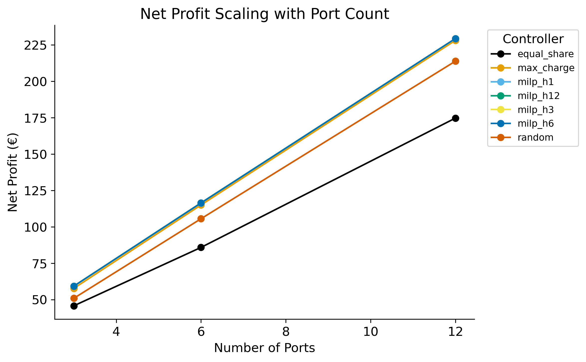
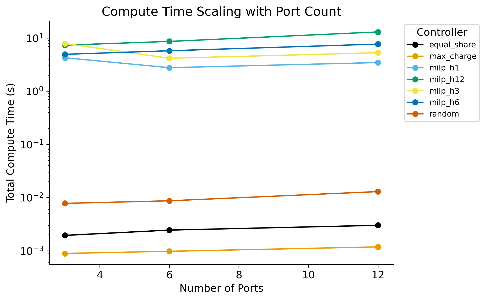
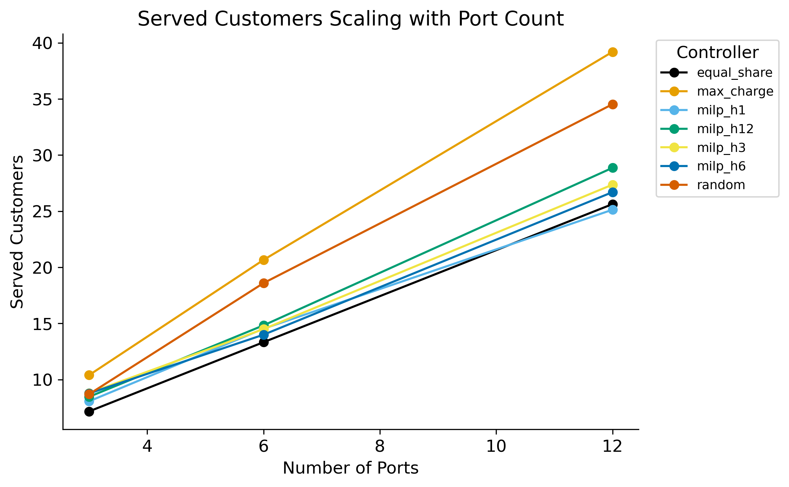

# Benchmark Report — `dynamic_1_5_p3_6_12_h1_3_6_12`

## Experiment Configuration

| Setting | Value |
|---|---|
| tariff | dynamic:1.5 |
| bess_enabled | True |
| v2g_enabled | True |
| solver | highs |
| ports | [3, 6, 12] |

Experiment IDs: dynamic_1_5_p3_6_12_h1_3_6_12

## Key Findings

- **Best net_profit:** `milp_h12` with mean **€135.08**
- **Lowest compute time:** `max_charge` at 0.00 ms/step
- **Best efficiency (€/compute-s):** `max_charge` = 125939.902

## Best-Performing Controller

      best_controller  mean_net_profit
ports                                 
3             milp_h6            59.30
6            milp_h12           116.52
12            milp_h6           229.42

## Full Results Table

                   net_profit_mean  net_profit_std  net_profit_min  net_profit_max  net_profit_median  net_profit_n  net_profit_ci_lower  net_profit_ci_upper  total_revenue_mean  total_revenue_std  total_revenue_min  total_revenue_max  total_revenue_median  total_revenue_n  total_revenue_ci_lower  total_revenue_ci_upper  total_cost_mean  total_cost_std  total_cost_min  total_cost_max  total_cost_median  total_cost_n  total_cost_ci_lower  total_cost_ci_upper  served_customers_mean  served_customers_std  served_customers_min  served_customers_max  served_customers_median  served_customers_n  served_customers_ci_lower  served_customers_ci_upper  rejected_customers_mean  rejected_customers_std  rejected_customers_min  rejected_customers_max  rejected_customers_median  rejected_customers_n  rejected_customers_ci_lower  rejected_customers_ci_upper  mean_soc_fulfillment_mean  mean_soc_fulfillment_std  mean_soc_fulfillment_min  mean_soc_fulfillment_max  mean_soc_fulfillment_median  mean_soc_fulfillment_n  mean_soc_fulfillment_ci_lower  mean_soc_fulfillment_ci_upper  gap_to_best_mean  gap_to_best_std  gap_to_best_min  gap_to_best_max  gap_to_best_median  gap_to_best_n  gap_to_best_ci_lower  gap_to_best_ci_upper  total_compute_s_mean  total_compute_s_std  total_compute_s_min  total_compute_s_max  total_compute_s_median  total_compute_s_n  total_compute_s_ci_lower  total_compute_s_ci_upper  mean_step_ms_mean  mean_step_ms_std  mean_step_ms_min  mean_step_ms_max  mean_step_ms_median  mean_step_ms_n  mean_step_ms_ci_lower  mean_step_ms_ci_upper
controller  ports                                                                                                                                                                                                                                                                                                                                                                                                                                                                                                                                                                                                                                                                                                                                                                                                                                                                                                                                                                                                                                                                                                                                                                                                                                                                                                                                                                                                                                                                                                                                                                                                    
equal_share 3                45.79           13.66           21.91           79.90              44.27            30                40.90                50.68              137.37              40.98              65.74             239.69                132.81               30                  122.71                  152.04            91.58           27.32           43.82          159.79              88.54            30                81.81               101.36                    7.2                   3.0                     1                    12                      7.5                  30                        6.1                        8.3                    235.3                    14.7                     206                     273                      236.5                    30                        230.0                        240.6                      0.911                     0.195                     0.000                     0.999                        0.996                      30                          0.842                          0.981            -13.54            10.33           -38.05            -1.31              -11.70             30                -17.24                 -9.85                  0.00                 0.00                 0.00                 0.00                    0.00                 30                      0.00                      0.00               0.01              0.00              0.01              0.01                 0.01              30                   0.01                   0.01
            6                85.90           17.15           54.15          109.57              90.51            30                79.76                92.04              257.70              51.44             162.44             328.72                271.52               30                  239.29                  276.11           171.80           34.29          108.29          219.15             181.01            30               159.53               184.07                   13.3                   4.4                     6                    20                     13.0                  30                       11.8                       14.9                    226.1                    16.5                     188                     270                      226.5                    30                        220.2                        232.0                      0.879                     0.125                     0.472                     0.998                        0.895                      30                          0.835                          0.924            -30.63            14.22           -61.72            -8.81              -27.52             30                -35.72                -25.54                  0.00                 0.00                 0.00                 0.00                    0.00                 30                      0.00                      0.00               0.01              0.00              0.01              0.01                 0.01              30                   0.01                   0.01
            12              174.77           31.69           81.49          232.37             176.07            30               163.43               186.11              524.31              95.07             244.47             697.12                528.22               30                  490.29                  558.33           349.54           63.38          162.98          464.74             352.15            30               326.86               372.22                   25.6                   5.9                    12                    38                     26.0                  30                       23.5                       27.7                    208.0                    16.7                     176                     240                      207.0                    30                        202.0                        214.0                      0.897                     0.088                     0.629                     0.997                        0.912                      30                          0.866                          0.929            -54.65            20.74           -86.81            -9.17              -53.05             30                -62.08                -47.23                  0.00                 0.00                 0.00                 0.00                    0.00                 30                      0.00                      0.00               0.01              0.00              0.01              0.01                 0.01              30                   0.01                   0.01
max_charge  3                57.76            9.38           38.35           80.61              58.21            30                54.41                61.12              173.29              28.14             115.05             241.84                174.64               30                  163.22                  183.36           115.53           18.76           76.70          161.22             116.43            30               108.81               122.24                   10.4                   1.8                     7                    13                     10.0                  30                        9.7                       11.1                    232.1                    15.2                     196                     266                      234.5                    30                        226.7                        237.6                      0.947                     0.069                     0.778                     0.999                        0.996                      30                          0.922                          0.972             -1.57             0.27            -2.14            -0.94               -1.61             30                 -1.67                 -1.47                  0.00                 0.00                 0.00                 0.00                    0.00                 30                      0.00                      0.00               0.00              0.00              0.00              0.00                 0.00              30                   0.00                   0.00
            6               115.06           18.67           76.61          160.90             115.53            30               108.38               121.74              345.19              56.01             229.83             482.69                346.59               30                  325.15                  365.23           230.13           37.34          153.22          321.79             231.06            30               216.77               243.49                   20.7                   3.5                    14                    28                     20.0                  30                       19.4                       21.9                    218.8                    16.3                     186                     259                      220.0                    30                        213.0                        224.7                      0.898                     0.092                     0.615                     0.999                        0.902                      30                          0.865                          0.931             -1.47             0.22            -1.93            -0.92               -1.50             30                 -1.55                 -1.39                  0.00                 0.00                 0.00                 0.00                    0.00                 30                      0.00                      0.00               0.00              0.00              0.00              0.00                 0.00              30                   0.00                   0.00
            12              228.18           36.86          152.70          317.65             229.11            30               214.99               241.37              684.55             110.59             458.11             952.95                687.34               30                  644.97                  724.12           456.37           73.73          305.41          635.30             458.22            30               429.98               482.75                   39.2                   2.9                    32                    43                     40.0                  30                       38.2                       40.2                    194.6                    15.9                     158                     229                      197.0                    30                        188.9                        200.3                      0.924                     0.045                     0.849                     0.998                        0.914                      30                          0.907                          0.940             -1.24             0.17            -1.62            -0.78               -1.23             30                 -1.31                 -1.18                  0.00                 0.00                 0.00                 0.00                    0.00                 30                      0.00                      0.00               0.00              0.00              0.00              0.00                 0.00              30                   0.00                   0.00
milp_h1     3                59.21            9.55           39.27           82.64              59.36            30                55.79                62.63              174.03              28.25             115.45             243.33                174.51               30                  163.92                  184.14           114.82           18.70           76.18          160.69             115.15            30               108.13               121.51                    8.1                   1.9                     5                    14                      8.0                  30                        7.4                        8.8                    234.4                    15.0                     200                     270                      235.0                    30                        229.1                        239.8                      0.906                     0.194                     0.000                     0.999                        0.997                      30                          0.837                          0.975             -0.13             0.11            -0.39             0.00               -0.09             30                 -0.17                 -0.09                  4.25                 0.68                 3.79                 6.16                    3.96                 30                      4.00                      4.49              14.75              2.37             13.15             21.39                13.73              30                  13.90                  15.59
            6               116.36           18.73           77.72          162.56             116.73            30               109.66               123.06              345.49              55.79             230.79             483.10                346.62               30                  325.53                  365.46           229.13           37.06          153.07          320.54             229.89            30               215.87               242.39                   14.5                   3.2                     7                    22                     14.5                  30                       13.4                       15.7                    225.1                    16.1                     190                     261                      225.5                    30                        219.3                        230.8                      0.872                     0.146                     0.304                     0.999                        0.893                      30                          0.820                          0.925             -0.17             0.14            -0.57             0.00               -0.13             30                 -0.22                 -0.12                  2.77                 0.10                 2.58                 3.01                    2.75                 30                      2.73                      2.80               9.60              0.35              8.97             10.46                 9.56              30                   9.47                   9.73
            12              229.34           37.05          153.52          319.18             230.30            30               216.09               242.60              684.43             110.75             458.20             952.95                687.34               30                  644.80                  724.07           455.09           73.71          304.68          633.77             457.04            30               428.71               481.47                   25.1                   3.7                    18                    32                     24.5                  30                       23.8                       26.5                    208.5                    15.7                     174                     242                      209.5                    30                        202.9                        214.1                      0.896                     0.070                     0.756                     0.998                        0.897                      30                          0.871                          0.921             -0.08             0.24            -1.28             0.00                0.00             30                 -0.17                  0.00                  3.45                 0.69                 3.05                 5.89                    3.25                 30                      3.20                      3.70              11.98              2.41             10.60             20.45                11.28              30                  11.12                  12.84
milp_h12    3                59.30            9.54           39.46           82.75              59.48            30                55.88                62.71              174.34              28.23             116.02             243.69                174.90               30                  164.23                  184.44           115.04           18.70           76.56          160.94             115.42            30               108.35               121.73                    8.5                   1.5                     6                    12                      8.0                  30                        7.9                        9.0                    234.0                    15.1                     200                     268                      235.0                    30                        228.6                        239.4                      0.929                     0.088                     0.739                     1.000                        0.996                      30                          0.897                          0.960             -0.04             0.09            -0.39             0.00                0.00             30                 -0.07                 -0.01                  7.34                 0.98                 5.75                10.14                    7.23                 30                      6.99                      7.69              25.48              3.41             19.97             35.22                25.11              30                  24.25                  26.70
            6               116.52           18.78           77.76          162.74             116.78            30               109.80               123.24              345.94              55.95             230.92             483.54                346.75               30                  325.91                  365.96           229.42           37.17          153.16          320.80             229.97            30               216.12               242.72                   14.8                   2.3                    10                    20                     15.0                  30                       14.0                       15.6                    224.8                    15.6                     191                     266                      225.5                    30                        219.2                        230.4                      0.929                     0.078                     0.742                     0.999                        0.944                      30                          0.901                          0.957             -0.01             0.03            -0.11             0.00               -0.00             30                 -0.02                  0.00                  8.62                 1.48                 7.18                14.12                    8.30                 30                      8.09                      9.15              29.93              5.15             24.93             49.03                28.81              30                  28.09                  31.77
            12              229.41           37.00          153.56          319.18             230.30            30               216.17               242.65              684.63             110.61             458.32             952.95                687.34               30                  645.05                  724.21           455.22           73.61          304.77          633.77             457.04            30               428.88               481.56                   28.9                   4.3                    23                    40                     28.0                  30                       27.3                       30.4                    205.6                    15.0                     174                     238                      207.0                    30                        200.3                        211.0                      0.923                     0.057                     0.790                     0.998                        0.924                      30                          0.903                          0.944             -0.02             0.09            -0.49             0.00               -0.00             30                 -0.05                  0.01                 12.99                 0.99                11.38                15.57                   12.80                 30                     12.63                     13.34              45.09              3.42             39.51             54.08                44.44              30                  43.87                  46.32
milp_h3     3                59.29            9.56           39.42           82.73              59.39            30                55.87                62.71              174.28              28.28             115.91             243.60                174.63               30                  164.16                  184.40           114.99           18.72           76.48          160.87             115.24            30               108.29               121.69                    8.8                   1.7                     5                    13                      9.0                  30                        8.2                        9.4                    233.8                    15.3                     200                     270                      235.5                    30                        228.3                        239.3                      0.883                     0.199                     0.000                     0.999                        0.957                      30                          0.812                          0.954             -0.05             0.06            -0.24             0.00               -0.02             30                 -0.07                 -0.02                  7.86                 3.55                 3.16                14.99                    7.08                 30                      6.59                      9.13              27.28             12.31             10.96             52.04                24.60              30                  22.87                  31.69
            6               116.41           18.78           77.72          162.64             116.76            30               109.69               123.13              345.62              55.94             230.79             483.24                346.70               30                  325.61                  365.64           229.21           37.16          153.07          320.60             229.94            30               215.92               242.51                   14.5                   2.7                     9                    20                     14.0                  30                       13.5                       15.5                    225.2                    14.7                     193                     261                      225.0                    30                        220.0                        230.5                      0.923                     0.070                     0.802                     0.999                        0.919                      30                          0.898                          0.948             -0.12             0.14            -0.64             0.00               -0.07             30                 -0.17                 -0.07                  4.16                 0.78                 3.44                 6.47                    3.91                 30                      3.88                      4.44              14.44              2.70             11.94             22.48                13.59              30                  13.48                  15.41
            12              229.28           36.90          153.52          319.18             230.30            30               216.08               242.49              684.25             110.31             458.20             952.95                687.34               30                  644.78                  723.73           454.97           73.41          304.68          633.77             457.04            30               428.70               481.24                   27.4                   4.6                    16                    39                     27.0                  30                       25.7                       29.0                    207.1                    16.2                     169                     245                      209.0                    30                        201.3                        212.9                      0.941                     0.054                     0.757                     0.999                        0.944                      30                          0.922                          0.961             -0.14             0.54            -2.95             0.00               -0.00             30                 -0.34                  0.05                  5.28                 0.55                 4.64                 7.08                    5.10                 30                      5.09                      5.48              18.34              1.91             16.10             24.59                17.72              30                  17.66                  19.03
milp_h6     3                59.30            9.54           39.46           82.75              59.46            30                55.89                62.71              174.33              28.22             116.02             243.69                174.83               30                  164.23                  184.43           115.03           18.69           76.56          160.94             115.37            30               108.35               121.72                    8.8                   2.3                     6                    16                      8.5                  30                        8.0                        9.6                    233.8                    15.5                     199                     273                      235.0                    30                        228.2                        239.3                      0.946                     0.077                     0.712                     0.999                        0.997                      30                          0.918                          0.973             -0.04             0.08            -0.34             0.00                0.00             30                 -0.06                 -0.01                  4.93                 0.58                 3.90                 6.44                    4.89                 30                      4.73                      5.14              17.13              2.01             13.55             22.35                16.98              30                  16.41                  17.85
            6               116.43           18.82           77.76          162.83             116.78            30               109.70               123.16              345.67              56.06             230.92             483.79                346.68               30                  325.61                  365.73           229.24           37.24          153.16          320.97             229.84            30               215.91               242.57                   14.0                   2.5                     9                    19                     14.0                  30                       13.1                       14.9                    225.8                    15.1                     195                     264                      228.0                    30                        220.4                        231.2                      0.913                     0.107                     0.554                     0.999                        0.943                      30                          0.875                          0.952             -0.10             0.25            -0.97             0.00               -0.00             30                 -0.19                 -0.01                  5.75                 0.85                 4.85                 8.93                    5.51                 30                      5.45                      6.06              19.98              2.94             16.84             31.02                19.14              30                  18.93                  21.03
            12              229.42           36.99          153.56          319.18             230.18            30               216.18               242.66              684.66             110.59             458.32             952.95                686.97               30                  645.09                  724.23           455.24           73.60          304.77          633.77             456.79            30               428.91               481.58                   26.7                   4.0                    19                    34                     26.5                  30                       25.3                       28.1                    207.9                    15.7                     171                     246                      209.0                    30                        202.3                        213.5                      0.928                     0.052                     0.786                     0.999                        0.936                      30                          0.909                          0.946             -0.01             0.04            -0.24             0.00               -0.00             30                 -0.02                  0.01                  7.68                 0.75                 6.30                 9.33                    7.72                 30                      7.41                      7.95              26.67              2.59             21.88             32.39                26.82              30                  25.75                  27.60
random      3                50.95            8.49           33.39           70.44              51.20            30                47.91                53.98              152.84              25.47             100.18             211.33                153.61               30                  143.72                  161.95           101.89           16.98           66.79          140.88             102.40            30                95.81               107.97                    8.7                   1.5                     6                    13                      9.0                  30                        8.2                        9.2                    233.8                    15.4                     199                     273                      236.0                    30                        228.3                        239.3                      0.954                     0.081                     0.682                     1.000                        0.997                      30                          0.924                          0.983             -8.39             1.31           -12.31            -5.73               -8.33             30                 -8.86                 -7.92                  0.01                 0.00                 0.01                 0.01                    0.01                 30                      0.01                      0.01               0.03              0.00              0.02              0.03                 0.03              30                   0.03                   0.03
            6               105.61           17.11           69.92          148.49             106.10            30                99.49               111.73              316.83              51.32             209.75             445.48                318.29               30                  298.46                  335.20           211.22           34.22          139.83          296.98             212.19            30               198.98               223.46                   18.6                   3.0                    11                    24                     18.5                  30                       17.5                       19.7                    221.0                    15.7                     187                     259                      222.5                    30                        215.4                        226.6                      0.903                     0.082                     0.737                     0.999                        0.904                      30                          0.874                          0.933            -10.92             1.92           -14.63            -7.59              -11.03             30                -11.61                -10.23                  0.01                 0.00                 0.01                 0.01                    0.01                 30                      0.01                      0.01               0.03              0.00              0.03              0.03                 0.03              30                   0.03                   0.03
            12              213.89           35.02          144.70          299.91             215.27            30               201.36               226.43              641.68             105.07             434.09             899.73                645.80               30                  604.08                  679.28           427.79           70.04          289.39          599.82             430.54            30               402.72               452.85                   34.5                   3.6                    27                    43                     34.0                  30                       33.2                       35.8                    199.0                    16.7                     161                     238                      202.0                    30                        193.0                        205.0                      0.915                     0.059                     0.793                     0.998                        0.913                      30                          0.894                          0.936            -15.53             2.75           -20.30            -8.53              -16.15             30                -16.52                -14.55                  0.01                 0.00                 0.01                 0.02                    0.01                 30                      0.01                      0.01               0.04              0.00              0.04              0.06                 0.04              30                   0.04                   0.05

## Trade-off Analysis

                   net_profit  mean_step_ms  served_customers  rejected_customers
controller  ports                                                                
equal_share 3           45.79          0.01              7.17              235.30
            6           85.90          0.01             13.33              226.10
            12         174.77          0.01             25.63              208.00
max_charge  3           57.76          0.00             10.40              232.13
            6          115.06          0.00             20.67              218.83
            12         228.18          0.00             39.20              194.60
milp_h1     3           59.21         14.75              8.07              234.43
            6          116.36          9.60             14.53              225.07
            12         229.34         11.98             25.13              208.47
milp_h12    3           59.30         25.48              8.47              234.03
            6          116.52         29.93             14.83              224.80
            12         229.41         45.09             28.87              205.63
milp_h3     3           59.29         27.28              8.80              233.80
            6          116.41         14.44             14.50              225.23
            12         229.28         18.34             27.37              207.10
milp_h6     3           59.30         17.13              8.77              233.77
            6          116.43         19.98             14.00              225.80
            12         229.42         26.67             26.70              207.87
random      3           50.95          0.03              8.70              233.83
            6          105.61          0.03             18.60              221.00
            12         213.89          0.04             34.53              199.00

## Scalability Analysis

## Statistical Significance Analysis

# Statistical Significance Summary

Metric: `net_profit`

Total pairs tested: 21  
Significant pairs (p < 0.05): 18

## Significant Differences

- **equal_share** vs **max_charge**: mean diff = -31.515, p (t-test) = 0.0000, Cohen's d = -1.366
- **equal_share** vs **milp_h1**: mean diff = -32.818, p (t-test) = 0.0000, Cohen's d = -1.427
- **equal_share** vs **milp_h12**: mean diff = -32.921, p (t-test) = 0.0000, Cohen's d = -1.432
- **equal_share** vs **milp_h3**: mean diff = -32.840, p (t-test) = 0.0000, Cohen's d = -1.432
- **equal_share** vs **milp_h6**: mean diff = -32.894, p (t-test) = 0.0000, Cohen's d = -1.430
- **equal_share** vs **random**: mean diff = -21.328, p (t-test) = 0.0000, Cohen's d = -1.051
- **max_charge** vs **milp_h1**: mean diff = -1.302, p (t-test) = 0.0000, Cohen's d = -4.540
- **max_charge** vs **milp_h12**: mean diff = -1.405, p (t-test) = 0.0000, Cohen's d = -5.319
- **max_charge** vs **milp_h3**: mean diff = -1.324, p (t-test) = 0.0000, Cohen's d = -3.228
- **max_charge** vs **milp_h6**: mean diff = -1.379, p (t-test) = 0.0000, Cohen's d = -4.896
- **max_charge** vs **random**: mean diff = 10.187, p (t-test) = 0.0000, Cohen's d = 2.771
- **milp_h1** vs **milp_h12**: mean diff = -0.103, p (t-test) = 0.0000, Cohen's d = -0.544
- **milp_h1** vs **milp_h6**: mean diff = -0.077, p (t-test) = 0.0021, Cohen's d = -0.333
- **milp_h1** vs **random**: mean diff = 11.489, p (t-test) = 0.0000, Cohen's d = 3.157
- **milp_h12** vs **milp_h3**: mean diff = 0.081, p (t-test) = 0.0241, Cohen's d = 0.242
- **milp_h12** vs **random**: mean diff = 11.592, p (t-test) = 0.0000, Cohen's d = 3.204
- **milp_h3** vs **random**: mean diff = 11.511, p (t-test) = 0.0000, Cohen's d = 3.200
- **milp_h6** vs **random**: mean diff = 11.566, p (t-test) = 0.0000, Cohen's d = 3.181

## Correlation Analysis

## Correlation Summary
**Top 5 positive correlations:**
- `total_compute_s` ↔ `mean_step_ms`: r = 1.000
- `total_revenue` ↔ `total_cost`: r = 1.000
- `net_profit` ↔ `total_revenue`: r = 1.000
- `net_profit` ↔ `total_cost`: r = 1.000
- `total_cost` ↔ `served_customers`: r = 0.847

**Top 5 negative correlations:**
- `served_customers` ↔ `rejected_customers`: r = -0.635
- `total_cost` ↔ `rejected_customers`: r = -0.577
- `total_revenue` ↔ `rejected_customers`: r = -0.576
- `net_profit` ↔ `rejected_customers`: r = -0.575
- `mean_step_ms` ↔ `profit_per_compute_s`: r = -0.482

## Robustness Analysis

                       cv     iqr  worst_case  best_case
controller  ports                                       
equal_share 3      0.2983  17.777       21.91      79.90
            6      0.1996  21.450       54.15     109.57
            12     0.1813  42.496       81.49     232.37
max_charge  3      0.1624   6.691       38.35      80.61
            6      0.1622  13.491       76.61     160.90
            12     0.1616  27.950      152.70     317.65
milp_h1     3      0.1613   6.943       39.27      82.64
            6      0.1609  13.750       77.72     162.56
            12     0.1615  27.944      153.52     319.18
milp_h12    3      0.1609   6.628       39.46      82.75
            6      0.1612  13.771       77.76     162.74
            12     0.1613  27.929      153.56     319.18
milp_h3     3      0.1612   6.687       39.42      82.73
            6      0.1613  13.696       77.72     162.64
            12     0.1609  27.833      153.52     319.18
milp_h6     3      0.1608   6.590       39.46      82.75
            6      0.1616  13.747       77.76     162.83
            12     0.1613  27.929      153.56     319.18
random      3      0.1667   6.585       33.39      70.44
            6      0.1620  12.308       69.92     148.49
            12     0.1637  23.906      144.70     299.91
