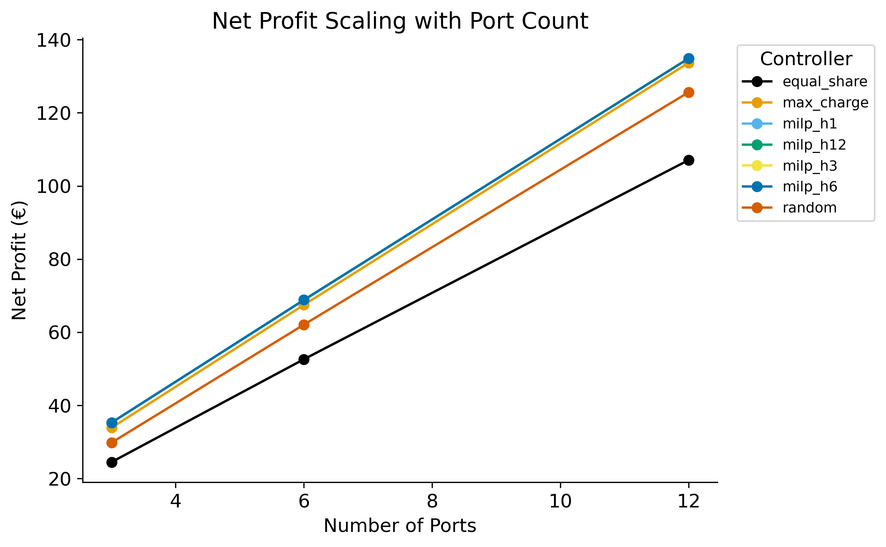
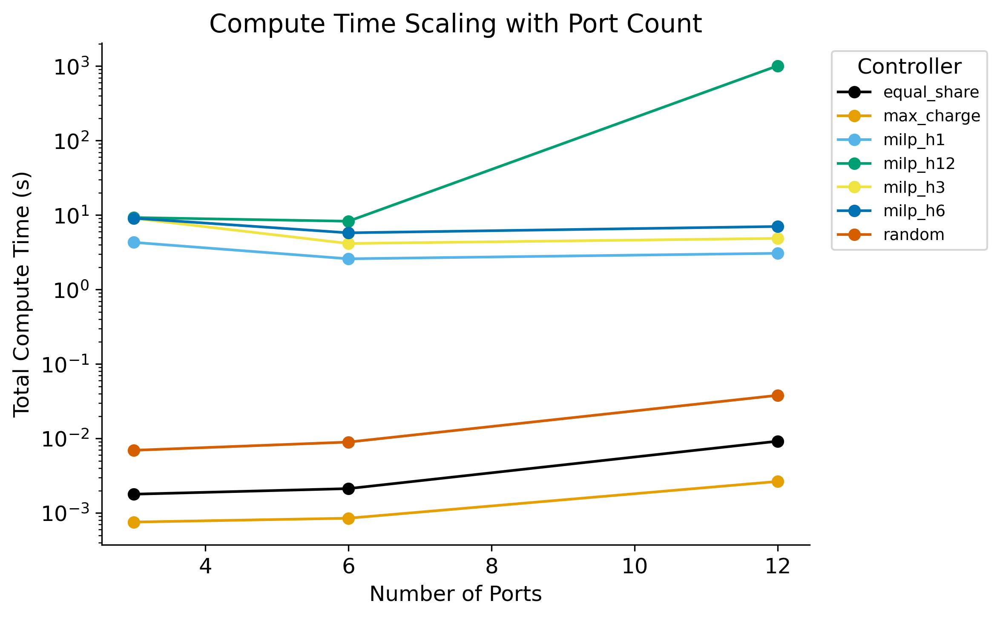
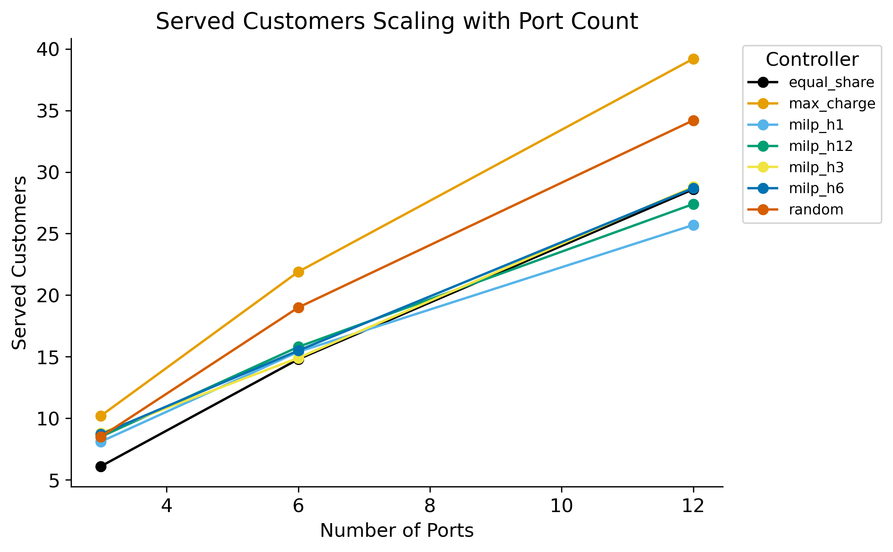

# Benchmark Report — `dynamic_1_3_p3_6_12_h1_3_6_12`

## Experiment Configuration

| Setting | Value |
|---|---|
| tariff | dynamic:1.3 |
| bess_enabled | True |
| v2g_enabled | True |
| solver | highs |
| ports | [3, 6, 12] |

Experiment IDs: dynamic_1_3_p3_6_12_h1_3_6_12

## Key Findings

- **Best net_profit:** `milp_h12` with mean **€79.68**
- **Lowest compute time:** `max_charge` at 0.00 ms/step
- **Best efficiency (€/compute-s):** `max_charge` = 59563.633

## Best-Performing Controller

      best_controller  mean_net_profit
ports                                 
3             milp_h6            35.30
6            milp_h12            68.85
12           milp_h12           134.91

## Full Results Table

                   net_profit_mean  net_profit_std  net_profit_min  net_profit_max  net_profit_median  net_profit_n  net_profit_ci_lower  net_profit_ci_upper  total_revenue_mean  total_revenue_std  total_revenue_min  total_revenue_max  total_revenue_median  total_revenue_n  total_revenue_ci_lower  total_revenue_ci_upper  total_cost_mean  total_cost_std  total_cost_min  total_cost_max  total_cost_median  total_cost_n  total_cost_ci_lower  total_cost_ci_upper  served_customers_mean  served_customers_std  served_customers_min  served_customers_max  served_customers_median  served_customers_n  served_customers_ci_lower  served_customers_ci_upper  rejected_customers_mean  rejected_customers_std  rejected_customers_min  rejected_customers_max  rejected_customers_median  rejected_customers_n  rejected_customers_ci_lower  rejected_customers_ci_upper  mean_soc_fulfillment_mean  mean_soc_fulfillment_std  mean_soc_fulfillment_min  mean_soc_fulfillment_max  mean_soc_fulfillment_median  mean_soc_fulfillment_n  mean_soc_fulfillment_ci_lower  mean_soc_fulfillment_ci_upper  gap_to_best_mean  gap_to_best_std  gap_to_best_min  gap_to_best_max  gap_to_best_median  gap_to_best_n  gap_to_best_ci_lower  gap_to_best_ci_upper  total_compute_s_mean  total_compute_s_std  total_compute_s_min  total_compute_s_max  total_compute_s_median  total_compute_s_n  total_compute_s_ci_lower  total_compute_s_ci_upper  mean_step_ms_mean  mean_step_ms_std  mean_step_ms_min  mean_step_ms_max  mean_step_ms_median  mean_step_ms_n  mean_step_ms_ci_lower  mean_step_ms_ci_upper
controller  ports                                                                                                                                                                                                                                                                                                                                                                                                                                                                                                                                                                                                                                                                                                                                                                                                                                                                                                                                                                                                                                                                                                                                                                                                                                                                                                                                                                                                                                                                                                                                                                                                    
equal_share 3                24.50            6.84           17.35           39.98              24.28            10                20.26                28.74              106.17              29.66              75.18             173.26                105.20               10                   87.79                  124.56            81.67           22.82           57.83          133.27              80.92            10                67.53                95.81                    6.1                   2.9                     2                    10                      6.5                  10                        4.3                        7.9                    239.0                    16.5                     218                     273                      237.5                    10                        228.8                        249.2                      0.929                     0.124                     0.641                     0.998                        0.997                      10                          0.852                          1.006            -10.82             6.57           -21.16            -1.67              -11.12             10                -14.89                 -6.75                  0.00                 0.00                 0.00                 0.00                    0.00                 10                      0.00                      0.00               0.01              0.00              0.01              0.01                 0.01              10                   0.01                   0.01
            6                52.62            6.35           41.33           62.41              53.94            10                48.68                56.55              228.00              27.53             179.08             270.44                233.74               10                  210.94                  245.07           175.39           21.18          137.76          208.03             179.80            10               162.26               188.51                   14.8                   4.7                     6                    19                     16.0                  10                       11.9                       17.7                    227.3                    20.1                     206                     270                      225.5                    10                        214.8                        239.8                      0.873                     0.166                     0.472                     0.998                        0.912                      10                          0.770                          0.976            -16.23             5.95           -26.75            -9.57              -15.04             10                -19.92                -12.55                  0.00                 0.00                 0.00                 0.00                    0.00                 10                      0.00                      0.00               0.01              0.00              0.01              0.01                 0.01              10                   0.01                   0.01
            12              107.08           11.96           90.34          127.02             106.79            10                99.66               114.49              464.00              51.83             391.47             550.41                462.76               10                  431.88                  496.13           356.92           39.87          301.13          423.40             355.97            10               332.21               381.64                   28.6                   4.3                    20                    35                     29.5                  10                       26.0                       31.2                    207.7                    17.2                     190                     240                      203.0                    10                        197.1                        218.3                      0.904                     0.070                     0.762                     0.996                        0.921                      10                          0.860                          0.947            -27.84             8.49           -44.27           -15.45              -27.96             10                -33.10                -22.57                  0.01                 0.00                 0.01                 0.01                    0.01                 10                      0.01                      0.01               0.03              0.01              0.02              0.03                 0.03              10                   0.03                   0.04
max_charge  3                33.88            3.63           26.54           40.32              34.00            10                31.63                36.13              146.83              15.72             114.99             174.74                147.34               10                  137.08                  156.57           112.94           12.09           88.45          134.41             113.34            10               105.45               120.44                   10.2                   2.1                     7                    13                     10.5                  10                        8.9                       11.5                    234.9                    16.4                     218                     266                      233.0                    10                        224.7                        245.1                      0.922                     0.090                     0.778                     0.998                        0.961                      10                          0.866                          0.978             -1.44             0.11            -1.60            -1.28               -1.45             10                 -1.51                 -1.37                  0.00                 0.00                 0.00                 0.00                    0.00                 10                      0.00                      0.00               0.00              0.00              0.00              0.00                 0.00              10                   0.00                   0.00
            6                67.48            7.24           52.94           80.56              67.83            10                62.99                71.97              292.41              31.39             229.43             349.08                293.94               10                  272.95                  311.86           224.93           24.15          176.48          268.52             226.11            10               209.96               239.90                   21.9                   4.4                    16                    28                     22.5                  10                       19.2                       24.6                    220.2                    19.4                     196                     259                      219.0                    10                        208.2                        232.2                      0.900                     0.103                     0.679                     0.998                        0.930                      10                          0.836                          0.964             -1.37             0.13            -1.57            -1.14               -1.37             10                 -1.45                 -1.29                  0.00                 0.00                 0.00                 0.00                    0.00                 10                      0.00                      0.00               0.00              0.00              0.00              0.00                 0.00              10                   0.00                   0.00
            12              133.67           14.38          104.99          159.89             134.87            10               124.76               142.59              579.26              62.32             454.97             692.87                584.42               10                  540.63                  617.88           445.58           47.94          349.98          532.98             449.56            10               415.87               475.29                   39.2                   2.9                    35                    43                     39.5                  10                       37.4                       41.0                    197.2                    16.0                     182                     229                      192.0                    10                        187.3                        207.1                      0.917                     0.045                     0.850                     0.996                        0.907                      10                          0.890                          0.945             -1.24             0.08            -1.37            -1.11               -1.23             10                 -1.29                 -1.19                  0.00                 0.00                 0.00                 0.00                    0.00                 10                      0.00                      0.00               0.01              0.00              0.01              0.01                 0.01              10                   0.01                   0.01
milp_h1     3                35.24            3.67           27.87           41.88              35.42            10                32.96                37.51              147.44              15.71             115.98             175.92                148.14               10                  137.70                  157.18           112.20           12.05           88.11          134.04             112.72            10               104.73               119.67                    8.1                   1.1                     6                     9                      8.5                  10                        7.4                        8.8                    237.1                    16.7                     219                     270                      233.5                    10                        226.8                        247.4                      0.909                     0.116                     0.726                     0.999                        0.997                      10                          0.837                          0.981             -0.09             0.07            -0.22            -0.00               -0.05             10                 -0.13                 -0.04                  4.31                 0.22                 4.04                 4.80                    4.23                 10                      4.17                      4.44              14.95              0.78             14.04             16.65                14.70              10                  14.47                  15.43
            6                68.75            7.29           54.21           81.99              69.19            10                64.23                73.26              292.66              31.40             230.13             349.74                294.53               10                  273.19                  312.12           223.91           24.12          175.91          267.74             225.34            10               208.96               238.86                   15.4                   3.2                    11                    22                     15.0                  10                       13.4                       17.4                    226.8                    15.3                     211                     261                      223.5                    10                        217.3                        236.3                      0.883                     0.118                     0.707                     0.999                        0.894                      10                          0.810                          0.955             -0.10             0.07            -0.23             0.00               -0.08             10                 -0.14                 -0.06                  2.59                 0.06                 2.52                 2.72                    2.59                 10                      2.55                      2.63               9.00              0.22              8.74              9.46                 8.98              10                   8.86                   9.14
            12              134.90           14.42          106.10          161.18             136.13            10               125.96               143.84              579.32              62.33             454.97             692.87                584.55               10                  540.69                  617.95           444.42           47.91          348.87          531.70             448.42            10               414.73               474.11                   25.7                   2.8                    22                    31                     26.0                  10                       24.0                       27.4                    210.4                    15.7                     191                     242                      208.5                    10                        200.7                        220.1                      0.861                     0.068                     0.761                     0.977                        0.843                      10                          0.819                          0.903             -0.01             0.02            -0.07             0.00                0.00             10                 -0.03                  0.00                  3.07                 0.49                 2.77                 4.39                    2.87                 10                      2.76                      3.38              10.66              1.72              9.61             15.25                 9.95              10                   9.60                  11.73
milp_h12    3                35.29            3.67           27.95           41.92              35.50            10                33.02                37.57              147.76              15.73             116.41             176.10                148.61               10                  138.01                  157.51           112.46           12.06           88.45          134.18             113.11            10               104.99               119.94                    8.5                   2.5                     6                    13                      7.5                  10                        7.0                       10.0                    236.6                    16.0                     217                     266                      233.0                    10                        226.7                        246.5                      0.784                     0.298                     0.000                     0.999                        0.870                      10                          0.600                          0.969             -0.03             0.06            -0.19             0.00                0.00             10                 -0.07                  0.01                  9.27                 3.35                 5.30                14.49                    8.22                 10                      7.19                     11.35              32.20             11.65             18.41             50.30                28.53              10                  24.98                  39.42
            6                68.85            7.30           54.27           82.12              69.24            10                64.32                73.37              293.03              31.45             230.34             350.23                294.74               10                  273.54                  312.53           224.18           24.15          176.07          268.11             225.50            10               209.21               239.16                   15.8                   3.2                    11                    22                     15.5                  10                       13.8                       17.8                    226.4                    18.3                     207                     265                      222.5                    10                        215.1                        237.7                      0.930                     0.107                     0.717                     0.999                        0.997                      10                          0.864                          0.997             -0.00             0.01            -0.02             0.00                0.00             10                 -0.01                  0.00                  8.28                 1.61                 7.10                12.50                    7.87                 10                      7.28                      9.28              28.75              5.61             24.64             43.41                27.31              10                  25.27                  32.22
            12              134.91           14.42          106.10          161.18             136.17            10               125.97               143.85              579.37              62.33             454.97             692.87                584.72               10                  540.74                  618.01           444.46           47.91          348.87          531.70             448.55            10               414.77               474.15                   27.4                   6.8                    19                    39                     24.0                  10                       23.2                       31.6                    210.0                    17.3                     192                     240                      207.5                    10                        199.3                        220.7                      0.859                     0.055                     0.732                     0.917                        0.868                      10                          0.825                          0.893             -0.00             0.00            -0.00            -0.00               -0.00             10                 -0.00                 -0.00               1011.67              3113.18                10.78              9871.85                   37.10                 10                   -917.90                   2941.24            3512.75          10809.66             37.44          34277.27               128.81              10               -3187.14               10212.65
milp_h3     3                35.26            3.68           27.85           41.92              35.43            10                32.97                37.54              147.54              15.79             115.87             176.10                148.19               10                  137.76                  157.33           112.29           12.11           88.02          134.18             112.76            10               104.78               119.79                    8.8                   2.0                     6                    12                      8.5                  10                        7.5                       10.1                    236.5                    17.5                     220                     271                      231.0                    10                        225.7                        247.3                      0.950                     0.069                     0.796                     0.998                        0.981                      10                          0.907                          0.992             -0.07             0.08            -0.25             0.00               -0.04             10                 -0.12                 -0.02                  9.06                 3.02                 5.56                13.23                    8.54                 10                      7.19                     10.93              31.46             10.47             19.29             45.95                29.66              10                  24.96                  37.95
            6                68.78            7.28           54.21           81.99              69.19            10                64.27                73.30              292.79              31.37             230.13             349.74                294.53               10                  273.35                  312.23           224.01           24.09          175.91          267.74             225.34            10               209.08               238.94                   14.9                   2.1                    12                    17                     16.0                  10                       13.6                       16.2                    227.5                    16.2                     212                     261                      223.5                    10                        217.5                        237.5                      0.927                     0.080                     0.802                     0.999                        0.955                      10                          0.877                          0.976             -0.07             0.06            -0.16             0.00               -0.05             10                 -0.10                 -0.03                  4.16                 0.84                 3.27                 5.73                    4.00                 10                      3.64                      4.68              14.44              2.92             11.34             19.89                13.88              10                  12.63                  16.25
            12              134.91           14.42          106.10          161.18             136.15            10               125.97               143.85              579.36              62.33             454.97             692.87                584.64               10                  540.72                  617.99           444.45           47.91          348.87          531.70             448.49            10               414.75               474.14                   28.8                   2.3                    25                    31                     30.0                  10                       27.4                       30.2                    209.0                    17.0                     189                     245                      204.0                    10                        198.4                        219.6                      0.864                     0.079                     0.683                     0.933                        0.889                      10                          0.815                          0.912             -0.00             0.01            -0.03             0.00               -0.00             10                 -0.01                  0.00                  4.87                 0.58                 4.38                 6.39                    4.72                 10                      4.51                      5.23              16.91              2.02             15.21             22.19                16.38              10                  15.66                  18.17
milp_h6     3                35.30            3.67           27.95           41.92              35.50            10                33.03                37.58              147.79              15.74             116.35             176.10                148.61               10                  138.03                  157.55           112.49           12.07           88.40          134.18             113.11            10               105.01               119.97                    8.7                   2.2                     6                    12                      9.0                  10                        7.3                       10.1                    236.4                    16.1                     219                     268                      232.5                    10                        226.4                        246.4                      0.786                     0.300                     0.000                     0.998                        0.813                      10                          0.600                          0.971             -0.02             0.05            -0.15             0.00               -0.00             10                 -0.05                  0.01                  9.09                 3.69                 6.03                17.06                    7.54                 10                      6.81                     11.38              31.58             12.81             20.93             59.23                26.18              10                  23.64                  39.52
            6                68.83            7.28           54.29           82.03              69.23            10                64.32                73.34              292.96              31.37             230.42             349.92                294.71               10                  273.52                  312.40           224.13           24.09          176.14          267.89             225.48            10               209.20               239.07                   15.5                   3.0                    12                    20                     15.0                  10                       13.7                       17.3                    227.3                    17.9                     211                     264                      221.5                    10                        216.2                        238.4                      0.902                     0.133                     0.614                     0.998                        0.980                      10                          0.819                          0.984             -0.02             0.04            -0.09             0.00               -0.00             10                 -0.05                 -0.00                  5.79                 1.47                 4.44                 8.65                    5.25                 10                      4.87                      6.70              20.09              5.10             15.41             30.04                18.23              10                  16.93                  23.25
            12              134.87           14.41          106.10          161.18             136.17            10               125.94               143.80              579.17              62.26             454.97             692.87                584.72               10                  540.57                  617.76           444.30           47.85          348.87          531.70             448.55            10               414.64               473.96                   28.7                   3.7                    25                    37                     28.0                  10                       26.4                       31.0                    208.5                    16.9                     191                     245                      202.5                    10                        198.1                        218.9                      0.912                     0.052                     0.829                     0.988                        0.919                      10                          0.880                          0.944             -0.05             0.13            -0.41             0.00               -0.00             10                 -0.13                  0.03                  7.04                 0.40                 6.42                 7.92                    7.04                 10                      6.79                      7.28              24.43              1.39             22.30             27.50                24.43              10                  23.57                  25.29
random      3                29.82            3.45           22.99           36.27              29.79            10                27.68                31.95              129.20              14.95              99.64             157.17                129.09               10                  119.94                  138.47            99.39           11.50           76.65          120.90              99.30            10                92.26               106.52                    8.5                   2.2                     6                    13                      8.5                  10                        7.2                        9.8                    236.7                    17.2                     220                     273                      233.5                    10                        226.1                        247.3                      0.965                     0.056                     0.835                     1.000                        0.997                      10                          0.930                          1.000             -5.51             0.47            -6.45            -4.96               -5.42             10                 -5.80                 -5.22                  0.01                 0.00                 0.01                 0.01                    0.01                 10                      0.01                      0.01               0.02              0.00              0.02              0.03                 0.02              10                   0.02                   0.02
            6                62.08            6.76           48.94           74.95              61.86            10                57.89                66.27              269.01              29.31             212.09             324.77                268.06               10                  250.85                  287.18           206.93           22.54          163.15          249.82             206.20            10               192.96               220.90                   19.0                   3.4                    13                    24                     19.0                  10                       16.9                       21.1                    223.3                    16.9                     204                     259                      220.0                    10                        212.8                        233.8                      0.890                     0.082                     0.788                     0.998                        0.877                      10                          0.839                          0.940             -6.77             0.69            -7.48            -5.34               -7.04             10                 -7.20                 -6.34                  0.01                 0.00                 0.01                 0.01                    0.01                 10                      0.01                      0.01               0.03              0.00              0.03              0.03                 0.03              10                   0.03                   0.03
            12              125.62           13.52           97.34          148.70             126.49            10               117.24               133.99              544.34              58.58             421.80             644.38                548.12               10                  508.03                  580.64           418.72           45.06          324.46          495.68             421.63            10               390.79               446.65                   34.2                   4.6                    27                    43                     33.0                  10                       31.3                       37.1                    202.0                    16.7                     186                     238                      196.5                    10                        191.6                        212.4                      0.902                     0.065                     0.793                     0.998                        0.902                      10                          0.861                          0.942             -9.30             1.42           -12.47            -7.59               -8.90             10                -10.18                 -8.41                  0.04                 0.01                 0.02                 0.04                    0.04                 10                      0.03                      0.04               0.13              0.02              0.08              0.15                 0.14              10                   0.12                   0.14

## Trade-off Analysis

                   net_profit  mean_step_ms  served_customers  rejected_customers
controller  ports                                                                
equal_share 3           24.50          0.01               6.1               239.0
            6           52.62          0.01              14.8               227.3
            12         107.08          0.03              28.6               207.7
max_charge  3           33.88          0.00              10.2               234.9
            6           67.48          0.00              21.9               220.2
            12         133.67          0.01              39.2               197.2
milp_h1     3           35.24         14.95               8.1               237.1
            6           68.75          9.00              15.4               226.8
            12         134.90         10.66              25.7               210.4
milp_h12    3           35.29         32.20               8.5               236.6
            6           68.85         28.75              15.8               226.4
            12         134.91       3512.75              27.4               210.0
milp_h3     3           35.26         31.46               8.8               236.5
            6           68.78         14.44              14.9               227.5
            12         134.91         16.91              28.8               209.0
milp_h6     3           35.30         31.58               8.7               236.4
            6           68.83         20.09              15.5               227.3
            12         134.87         24.43              28.7               208.5
random      3           29.82          0.02               8.5               236.7
            6           62.08          0.03              19.0               223.3
            12         125.62          0.13              34.2               202.0

## Scalability Analysis

## Statistical Significance Analysis

# Statistical Significance Summary

Metric: `net_profit`

Total pairs tested: 21  
Significant pairs (p < 0.05): 17

## Significant Differences

- **equal_share** vs **max_charge**: mean diff = -16.947, p (t-test) = 0.0000, Cohen's d = -1.697
- **equal_share** vs **milp_h1**: mean diff = -18.231, p (t-test) = 0.0000, Cohen's d = -1.831
- **equal_share** vs **milp_h12**: mean diff = -18.286, p (t-test) = 0.0000, Cohen's d = -1.838
- **equal_share** vs **milp_h3**: mean diff = -18.251, p (t-test) = 0.0000, Cohen's d = -1.832
- **equal_share** vs **milp_h6**: mean diff = -18.266, p (t-test) = 0.0000, Cohen's d = -1.840
- **equal_share** vs **random**: mean diff = -11.105, p (t-test) = 0.0000, Cohen's d = -1.305
- **max_charge** vs **milp_h1**: mean diff = -1.284, p (t-test) = 0.0000, Cohen's d = -10.614
- **max_charge** vs **milp_h12**: mean diff = -1.339, p (t-test) = 0.0000, Cohen's d = -9.737
- **max_charge** vs **milp_h3**: mean diff = -1.305, p (t-test) = 0.0000, Cohen's d = -10.039
- **max_charge** vs **milp_h6**: mean diff = -1.319, p (t-test) = 0.0000, Cohen's d = -8.769
- **max_charge** vs **random**: mean diff = 5.841, p (t-test) = 0.0000, Cohen's d = 3.053
- **milp_h1** vs **milp_h12**: mean diff = -0.055, p (t-test) = 0.0002, Cohen's d = -0.766
- **milp_h1** vs **random**: mean diff = 7.125, p (t-test) = 0.0000, Cohen's d = 3.789
- **milp_h12** vs **milp_h3**: mean diff = 0.034, p (t-test) = 0.0168, Cohen's d = 0.463
- **milp_h12** vs **random**: mean diff = 7.180, p (t-test) = 0.0000, Cohen's d = 3.864
- **milp_h3** vs **random**: mean diff = 7.146, p (t-test) = 0.0000, Cohen's d = 3.808
- **milp_h6** vs **random**: mean diff = 7.161, p (t-test) = 0.0000, Cohen's d = 3.877

## Correlation Analysis

## Correlation Summary
**Top 5 positive correlations:**
- `total_compute_s` ↔ `mean_step_ms`: r = 1.000
- `total_revenue` ↔ `total_cost`: r = 1.000
- `net_profit` ↔ `total_revenue`: r = 1.000
- `net_profit` ↔ `total_cost`: r = 1.000
- `total_cost` ↔ `served_customers`: r = 0.882

**Top 5 negative correlations:**
- `served_customers` ↔ `rejected_customers`: r = -0.632
- `total_cost` ↔ `rejected_customers`: r = -0.517
- `total_revenue` ↔ `rejected_customers`: r = -0.517
- `net_profit` ↔ `rejected_customers`: r = -0.514
- `rejected_customers` ↔ `mean_step_ms`: r = -0.096

## Robustness Analysis

                       cv     iqr  worst_case  best_case
controller  ports                                       
equal_share 3      0.2794   7.916       17.35      39.98
            6      0.1207   4.364       41.33      62.41
            12     0.1117  14.198       90.34     127.02
max_charge  3      0.1071   3.161       26.54      40.32
            6      0.1074   5.840       52.94      80.56
            12     0.1076  11.317      104.99     159.89
milp_h1     3      0.1040   2.981       27.87      41.88
            6      0.1060   5.708       54.21      81.99
            12     0.1069  11.391      106.10     161.18
milp_h12    3      0.1041   2.977       27.95      41.92
            6      0.1060   5.691       54.27      82.12
            12     0.1069  11.401      106.10     161.18
milp_h3     3      0.1045   2.831       27.85      41.92
            6      0.1058   5.780       54.21      81.99
            12     0.1069  11.401      106.10     161.18
milp_h6     3      0.1041   2.961       27.95      41.92
            6      0.1057   5.679       54.29      82.03
            12     0.1068  11.297      106.10     161.18
random      3      0.1157   2.979       22.99      36.27
            6      0.1089   5.264       48.94      74.95
            12     0.1076  10.794       97.34     148.70
