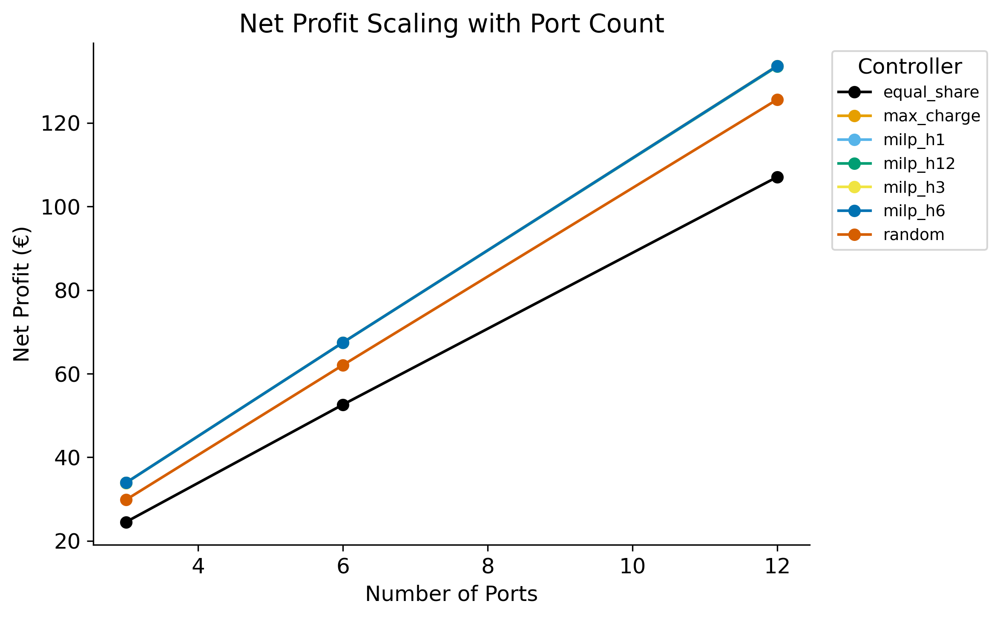
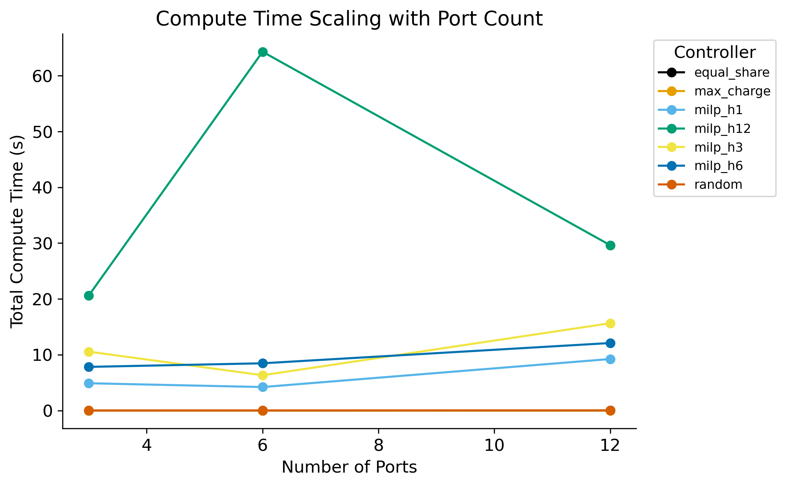
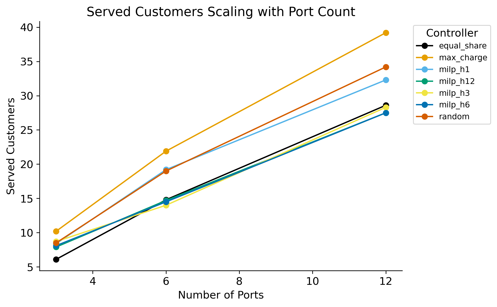

# Benchmark Report — `dynamic_1_3_p3_6_12_h1_3_6_12`

## Experiment Configuration

| Setting | Value |
|---|---|
| tariff | dynamic:1.3 |
| bess_enabled | True |
| v2g_enabled | False |
| solver | highs |
| ports | [3, 6, 12] |

Experiment IDs: dynamic_1_3_p3_6_12_h1_3_6_12

## Key Findings

- **Best net_profit:** `max_charge` with mean **€78.35**
- **Lowest compute time:** `max_charge` at 0.01 ms/step
- **Best efficiency (€/compute-s):** `max_charge` = 48112.603

## Best-Performing Controller

      best_controller  mean_net_profit
ports                                 
3            milp_h12            33.89
6             milp_h1            67.48
12         max_charge           133.67

## Full Results Table

                   net_profit_mean  net_profit_std  net_profit_min  net_profit_max  net_profit_median  net_profit_n  net_profit_ci_lower  net_profit_ci_upper  total_revenue_mean  total_revenue_std  total_revenue_min  total_revenue_max  total_revenue_median  total_revenue_n  total_revenue_ci_lower  total_revenue_ci_upper  total_cost_mean  total_cost_std  total_cost_min  total_cost_max  total_cost_median  total_cost_n  total_cost_ci_lower  total_cost_ci_upper  served_customers_mean  served_customers_std  served_customers_min  served_customers_max  served_customers_median  served_customers_n  served_customers_ci_lower  served_customers_ci_upper  rejected_customers_mean  rejected_customers_std  rejected_customers_min  rejected_customers_max  rejected_customers_median  rejected_customers_n  rejected_customers_ci_lower  rejected_customers_ci_upper  mean_soc_fulfillment_mean  mean_soc_fulfillment_std  mean_soc_fulfillment_min  mean_soc_fulfillment_max  mean_soc_fulfillment_median  mean_soc_fulfillment_n  mean_soc_fulfillment_ci_lower  mean_soc_fulfillment_ci_upper  gap_to_best_mean  gap_to_best_std  gap_to_best_min  gap_to_best_max  gap_to_best_median  gap_to_best_n  gap_to_best_ci_lower  gap_to_best_ci_upper  total_compute_s_mean  total_compute_s_std  total_compute_s_min  total_compute_s_max  total_compute_s_median  total_compute_s_n  total_compute_s_ci_lower  total_compute_s_ci_upper  mean_step_ms_mean  mean_step_ms_std  mean_step_ms_min  mean_step_ms_max  mean_step_ms_median  mean_step_ms_n  mean_step_ms_ci_lower  mean_step_ms_ci_upper
controller  ports                                                                                                                                                                                                                                                                                                                                                                                                                                                                                                                                                                                                                                                                                                                                                                                                                                                                                                                                                                                                                                                                                                                                                                                                                                                                                                                                                                                                                                                                                                                                                                                                    
equal_share 3                24.50            6.84           17.35           39.98              24.28            10                20.26                28.74              106.17              29.66              75.18             173.26                105.20               10                   87.79                  124.56            81.67           22.82           57.83          133.27              80.92            10                67.53                95.81                    6.1                   2.9                     2                    10                      6.5                  10                        4.3                        7.9                    239.0                    16.5                     218                     273                      237.5                    10                        228.8                        249.2                      0.929                     0.124                     0.641                     0.998                        0.997                      10                          0.852                          1.006             -9.39             6.57           -19.60            -0.26               -9.72             10                -13.46                 -5.32                  0.00                 0.00                 0.00                 0.01                    0.00                 10                      0.00                      0.00               0.01              0.00              0.01              0.02                 0.01              10                   0.01                   0.01
            6                52.62            6.35           41.33           62.41              53.94            10                48.68                56.55              228.00              27.53             179.08             270.44                233.74               10                  210.94                  245.07           175.39           21.18          137.76          208.03             179.80            10               162.26               188.51                   14.8                   4.7                     6                    19                     16.0                  10                       11.9                       17.7                    227.3                    20.1                     206                     270                      225.5                    10                        214.8                        239.8                      0.873                     0.166                     0.472                     0.998                        0.912                      10                          0.770                          0.976            -14.86             5.93           -25.53            -8.17              -13.58             10                -18.54                -11.18                  0.00                 0.00                 0.00                 0.01                    0.00                 10                      0.00                      0.00               0.01              0.00              0.01              0.02                 0.01              10                   0.01                   0.02
            12              107.08           11.96           90.34          127.02             106.79            10                99.66               114.49              464.00              51.83             391.47             550.41                462.76               10                  431.88                  496.13           356.92           39.87          301.13          423.40             355.97            10               332.21               381.64                   28.6                   4.3                    20                    35                     29.5                  10                       26.0                       31.2                    207.7                    17.2                     190                     240                      203.0                    10                        197.1                        218.3                      0.904                     0.070                     0.762                     0.996                        0.921                      10                          0.860                          0.947            -26.60             8.44           -42.90           -14.34              -26.77             10                -31.83                -21.37                  0.01                 0.00                 0.01                 0.01                    0.01                 10                      0.01                      0.01               0.03              0.01              0.02              0.04                 0.04              10                   0.02                   0.04
max_charge  3                33.88            3.63           26.54           40.32              34.00            10                31.63                36.13              146.83              15.72             114.99             174.74                147.34               10                  137.08                  156.57           112.94           12.09           88.45          134.41             113.34            10               105.45               120.44                   10.2                   2.1                     7                    13                     10.5                  10                        8.9                       11.5                    234.9                    16.4                     218                     266                      233.0                    10                        224.7                        245.1                      0.922                     0.090                     0.778                     0.998                        0.961                      10                          0.866                          0.978             -0.01             0.02            -0.07             0.00                0.00             10                 -0.02                  0.00                  0.00                 0.00                 0.00                 0.00                    0.00                 10                      0.00                      0.00               0.00              0.00              0.00              0.01                 0.00              10                   0.00                   0.00
            6                67.48            7.24           52.94           80.56              67.83            10                62.99                71.97              292.41              31.39             229.43             349.08                293.94               10                  272.95                  311.86           224.93           24.15          176.48          268.52             226.11            10               209.96               239.90                   21.9                   4.4                    16                    28                     22.5                  10                       19.2                       24.6                    220.2                    19.4                     196                     259                      219.0                    10                        208.2                        232.2                      0.900                     0.103                     0.679                     0.998                        0.930                      10                          0.836                          0.964             -0.00             0.00            -0.00             0.00                0.00             10                 -0.00                  0.00                  0.00                 0.00                 0.00                 0.00                    0.00                 10                      0.00                      0.00               0.00              0.00              0.00              0.01                 0.00              10                   0.00                   0.00
            12              133.67           14.38          104.99          159.89             134.87            10               124.76               142.59              579.26              62.32             454.97             692.87                584.42               10                  540.63                  617.88           445.58           47.94          349.98          532.98             449.56            10               415.87               475.29                   39.2                   2.9                    35                    43                     39.5                  10                       37.4                       41.0                    197.2                    16.0                     182                     229                      192.0                    10                        187.3                        207.1                      0.917                     0.045                     0.850                     0.996                        0.907                      10                          0.890                          0.945             -0.00             0.00            -0.00             0.00               -0.00             10                 -0.00                 -0.00                  0.00                 0.00                 0.00                 0.00                    0.00                 10                      0.00                      0.00               0.01              0.00              0.01              0.01                 0.01              10                   0.01                   0.01
milp_h1     3                33.86            3.62           26.54           40.32              34.00            10                31.62                36.10              146.72              15.68             114.99             174.74                147.33               10                  137.00                  156.44           112.86           12.06           88.45          134.41             113.33            10               105.39               120.34                    8.4                   1.5                     7                    11                      8.0                  10                        7.5                        9.3                    236.7                    16.2                     219                     270                      233.0                    10                        226.6                        246.8                      0.949                     0.093                     0.697                     0.998                        0.997                      10                          0.891                          1.007             -0.03             0.03            -0.08             0.00               -0.03             10                 -0.06                 -0.01                  4.89                 1.99                 2.66                 8.22                    4.12                 10                      3.66                      6.13              16.99              6.90              9.25             28.53                14.30              10                  12.71                  21.27
            6                67.48            7.24           52.94           80.56              67.83            10                62.99                71.97              292.41              31.39             229.43             349.08                293.94               10                  272.95                  311.86           224.93           24.15          176.48          268.52             226.11            10               209.96               239.90                   19.2                   2.4                    15                    23                     19.5                  10                       17.7                       20.7                    223.2                    18.7                     201                     260                      218.5                    10                        211.6                        234.8                      0.885                     0.123                     0.672                     0.998                        0.912                      10                          0.809                          0.961             -0.00             0.00            -0.00             0.00                0.00             10                 -0.00                  0.00                  4.21                 0.73                 3.84                 6.25                    3.96                 10                      3.76                      4.66              14.63              2.53             13.32             21.70                13.74              10                  13.06                  16.20
            12              133.55           14.65          103.77          159.89             134.87            10               124.47               142.64              578.73              63.50             449.69             692.87                584.42               10                  539.37                  618.09           445.17           48.85          345.91          532.98             449.56            10               414.90               475.45                   32.3                   4.5                    25                    38                     32.5                  10                       29.5                       35.1                    203.9                    14.6                     182                     232                      199.5                    10                        194.8                        213.0                      0.864                     0.065                     0.774                     0.948                        0.871                      10                          0.824                          0.905             -0.12             0.39            -1.22             0.00               -0.00             10                 -0.36                  0.12                  9.24                 0.16                 9.05                 9.56                    9.19                 10                      9.14                      9.34              32.07              0.56             31.43             33.21                31.90              10                  31.72                  32.41
milp_h12    3                33.89            3.63           26.54           40.32              34.03            10                31.64                36.13              146.84              15.71             114.99             174.74                147.48               10                  137.10                  156.58           112.95           12.09           88.45          134.41             113.45            10               105.46               120.44                    7.9                   2.4                     5                    12                      7.0                  10                        6.4                        9.4                    237.2                    16.6                     220                     270                      233.5                    10                        226.9                        247.5                      0.907                     0.124                     0.639                     0.999                        0.976                      10                          0.830                          0.984             -0.01             0.02            -0.07             0.00               -0.00             10                 -0.02                  0.01                 20.62                 5.22                10.48                27.79                   21.69                 10                     17.38                     23.86              71.59             18.13             36.40             96.48                75.30              10                  60.35                  82.83
            6                67.47            7.24           52.94           80.56              67.81            10                62.98                71.96              292.38              31.39             229.43             349.08                293.82               10                  272.93                  311.84           224.91           24.14          176.48          268.52             226.02            10               209.95               239.88                   14.7                   2.8                    10                    19                     15.0                  10                       13.0                       16.4                    227.8                    18.2                     206                     265                      226.0                    10                        216.5                        239.1                      0.941                     0.086                     0.779                     0.999                        0.998                      10                          0.887                          0.994             -0.01             0.02            -0.05             0.00                0.00             10                 -0.02                  0.01                 64.31               163.18                10.50               528.68                   12.72                 10                    -36.83                    165.45             223.29            566.61             36.45           1835.68                44.15              10                -127.90                 574.47
            12              133.53           14.70          103.58          159.89             134.84            10               124.42               142.64              578.62              63.69             448.84             692.87                584.30               10                  539.14                  618.09           445.09           48.99          345.26          532.98             449.46            10               414.73               475.45                   27.5                   4.3                    22                    37                     27.0                  10                       24.8                       30.2                    210.2                    18.8                     186                     246                      205.5                    10                        198.6                        221.8                      0.913                     0.048                     0.845                     0.999                        0.927                      10                          0.884                          0.943             -0.15             0.45            -1.42             0.00                0.00             10                 -0.42                  0.13                 29.64                11.60                16.72                43.68                   28.64                 10                     22.45                     36.83             102.91             40.28             58.04            151.66                99.43              10                  77.95                 127.88
milp_h3     3                33.88            3.62           26.54           40.32              34.03            10                31.63                36.12              146.80              15.70             114.99             174.74                147.48               10                  137.06                  156.53           112.92           12.08           88.45          134.41             113.45            10               105.43               120.41                    8.7                   2.9                     6                    14                      7.5                  10                        6.9                       10.5                    236.4                    17.1                     219                     270                      233.5                    10                        225.8                        247.0                      0.876                     0.159                     0.490                     0.999                        0.907                      10                          0.777                          0.975             -0.02             0.05            -0.17             0.00               -0.00             10                 -0.05                  0.02                 10.56                 2.59                 5.96                14.60                   10.77                 10                      8.95                     12.17              36.67              9.00             20.70             50.68                37.40              10                  31.09                  42.24
            6                67.48            7.24           52.94           80.56              67.83            10                62.99                71.97              292.41              31.39             229.43             349.08                293.94               10                  272.95                  311.86           224.93           24.15          176.48          268.52             226.11            10               209.96               239.90                   14.0                   2.0                    11                    16                     14.0                  10                       12.8                       15.2                    228.6                    16.2                     213                     264                      223.5                    10                        218.5                        238.7                      0.903                     0.115                     0.669                     0.999                        0.946                      10                          0.832                          0.974             -0.00             0.00            -0.00             0.00                0.00             10                 -0.00                  0.00                  6.33                 1.06                 5.10                 8.37                    6.61                 10                      5.67                      6.98              21.97              3.67             17.72             29.07                22.95              10                  19.69                  24.25
            12              133.62           14.44          104.73          159.89             134.71            10               124.67               142.56              579.00              62.55             453.85             692.87                583.72               10                  540.23                  617.78           445.39           48.12          349.11          532.98             449.02            10               415.56               475.21                   28.3                   3.6                    22                    33                     29.5                  10                       26.1                       30.5                    209.3                    18.0                     191                     243                      202.0                    10                        198.1                        220.5                      0.881                     0.058                     0.772                     0.950                        0.895                      10                          0.845                          0.918             -0.06             0.10            -0.26             0.00               -0.00             10                 -0.12                  0.00                 15.65                 2.91                11.93                21.38                   15.20                 10                     13.85                     17.46              54.34             10.12             41.42             74.22                52.79              10                  48.07                  60.62
milp_h6     3                33.89            3.63           26.54           40.32              34.03            10                31.64                36.13              146.84              15.71             114.99             174.74                147.48               10                  137.10                  156.58           112.95           12.09           88.45          134.41             113.45            10               105.46               120.44                    8.1                   2.3                     6                    12                      7.5                  10                        6.7                        9.5                    237.0                    16.5                     220                     270                      233.5                    10                        226.8                        247.2                      0.892                     0.163                     0.490                     0.999                        0.976                      10                          0.791                          0.993             -0.01             0.02            -0.07             0.00               -0.00             10                 -0.02                  0.01                  7.83                 0.70                 7.02                 9.25                    7.83                 10                      7.39                      8.26              27.18              2.44             24.39             32.11                27.20              10                  25.67                  28.69
            6                67.48            7.24           52.94           80.56              67.83            10                62.99                71.97              292.41              31.39             229.43             349.08                293.94               10                  272.95                  311.86           224.93           24.15          176.48          268.52             226.11            10               209.96               239.90                   14.5                   2.5                    11                    19                     14.5                  10                       12.9                       16.1                    227.9                    16.8                     213                     264                      219.5                    10                        217.5                        238.3                      0.889                     0.131                     0.586                     0.998                        0.921                      10                          0.808                          0.971             -0.00             0.00            -0.00             0.00                0.00             10                 -0.00                  0.00                  8.47                 1.44                 7.00                11.82                    8.48                 10                      7.58                      9.36              29.41              5.01             24.30             41.03                29.46              10                  26.31                  32.52
            12              133.63           14.44          104.73          159.89             134.79            10               124.68               142.58              579.08              62.57             453.85             692.87                584.09               10                  540.30                  617.86           445.44           48.13          349.11          532.98             449.30            10               415.61               475.28                   27.5                   4.4                    22                    38                     27.0                  10                       24.8                       30.2                    209.4                    18.3                     191                     243                      202.0                    10                        198.0                        220.8                      0.886                     0.050                     0.820                     0.963                        0.894                      10                          0.855                          0.918             -0.04             0.09            -0.26             0.00                0.00             10                 -0.10                  0.01                 12.10                 4.16                 9.92                23.78                   10.70                 10                      9.52                     14.68              42.02             14.44             34.44             82.58                37.15              10                  33.07                  50.97
random      3                29.82            3.45           22.99           36.27              29.79            10                27.68                31.95              129.20              14.95              99.64             157.17                129.09               10                  119.94                  138.47            99.39           11.50           76.65          120.90              99.30            10                92.26               106.52                    8.5                   2.2                     6                    13                      8.5                  10                        7.2                        9.8                    236.7                    17.2                     220                     273                      233.5                    10                        226.1                        247.3                      0.965                     0.056                     0.835                     1.000                        0.997                      10                          0.930                          1.000             -4.08             0.41            -4.89            -3.54               -4.03             10                 -4.33                 -3.82                  0.01                 0.00                 0.01                 0.01                    0.01                 10                      0.01                      0.01               0.04              0.00              0.04              0.05                 0.04              10                   0.04                   0.05
            6                62.08            6.76           48.94           74.95              61.86            10                57.89                66.27              269.01              29.31             212.09             324.77                268.06               10                  250.85                  287.18           206.93           22.54          163.15          249.82             206.20            10               192.96               220.90                   19.0                   3.4                    13                    24                     19.0                  10                       16.9                       21.1                    223.3                    16.9                     204                     259                      220.0                    10                        212.8                        233.8                      0.890                     0.082                     0.788                     0.998                        0.877                      10                          0.839                          0.940             -5.40             0.69            -6.09            -4.00               -5.69             10                 -5.83                 -4.97                  0.03                 0.00                 0.02                 0.03                    0.03                 10                      0.03                      0.03               0.10              0.00              0.08              0.10                 0.10              10                   0.09                   0.10
            12              125.62           13.52           97.34          148.70             126.49            10               117.24               133.99              544.34              58.58             421.80             644.38                548.12               10                  508.03                  580.64           418.72           45.06          324.46          495.68             421.63            10               390.79               446.65                   34.2                   4.6                    27                    43                     33.0                  10                       31.3                       37.1                    202.0                    16.7                     186                     238                      196.5                    10                        191.6                        212.4                      0.902                     0.065                     0.793                     0.998                        0.902                      10                          0.861                          0.942             -8.06             1.40           -11.19            -6.34               -7.75             10                 -8.93                 -7.19                  0.04                 0.00                 0.04                 0.05                    0.04                 10                      0.04                      0.04               0.14              0.01              0.13              0.16                 0.15              10                   0.14                   0.15

## Trade-off Analysis

                   net_profit  mean_step_ms  served_customers  rejected_customers
controller  ports                                                                
equal_share 3           24.50          0.01               6.1               239.0
            6           52.62          0.01              14.8               227.3
            12         107.08          0.03              28.6               207.7
max_charge  3           33.88          0.00              10.2               234.9
            6           67.48          0.00              21.9               220.2
            12         133.67          0.01              39.2               197.2
milp_h1     3           33.86         16.99               8.4               236.7
            6           67.48         14.63              19.2               223.2
            12         133.55         32.07              32.3               203.9
milp_h12    3           33.89         71.59               7.9               237.2
            6           67.47        223.29              14.7               227.8
            12         133.53        102.91              27.5               210.2
milp_h3     3           33.88         36.67               8.7               236.4
            6           67.48         21.97              14.0               228.6
            12         133.62         54.34              28.3               209.3
milp_h6     3           33.89         27.18               8.1               237.0
            6           67.48         29.41              14.5               227.9
            12         133.63         42.02              27.5               209.4
random      3           29.82          0.04               8.5               236.7
            6           62.08          0.10              19.0               223.3
            12         125.62          0.14              34.2               202.0

## Scalability Analysis

## Statistical Significance Analysis

# Statistical Significance Summary

Metric: `net_profit`

Total pairs tested: 21  
Significant pairs (p < 0.05): 11

## Significant Differences

- **equal_share** vs **max_charge**: mean diff = -16.947, p (t-test) = 0.0000, Cohen's d = -1.697
- **equal_share** vs **milp_h1**: mean diff = -16.898, p (t-test) = 0.0000, Cohen's d = -1.689
- **equal_share** vs **milp_h12**: mean diff = -16.897, p (t-test) = 0.0000, Cohen's d = -1.689
- **equal_share** vs **milp_h3**: mean diff = -16.925, p (t-test) = 0.0000, Cohen's d = -1.697
- **equal_share** vs **milp_h6**: mean diff = -16.934, p (t-test) = 0.0000, Cohen's d = -1.698
- **equal_share** vs **random**: mean diff = -11.105, p (t-test) = 0.0000, Cohen's d = -1.305
- **max_charge** vs **random**: mean diff = 5.841, p (t-test) = 0.0000, Cohen's d = 3.053
- **milp_h1** vs **random**: mean diff = 5.792, p (t-test) = 0.0000, Cohen's d = 3.061
- **milp_h12** vs **random**: mean diff = 5.791, p (t-test) = 0.0000, Cohen's d = 3.078
- **milp_h3** vs **random**: mean diff = 5.820, p (t-test) = 0.0000, Cohen's d = 3.072
- **milp_h6** vs **random**: mean diff = 5.829, p (t-test) = 0.0000, Cohen's d = 3.075

## Correlation Analysis

## Correlation Summary
**Top 5 positive correlations:**
- `total_compute_s` ↔ `mean_step_ms`: r = 1.000
- `net_profit` ↔ `total_revenue`: r = 1.000
- `total_revenue` ↔ `total_cost`: r = 1.000
- `net_profit` ↔ `total_cost`: r = 1.000
- `total_revenue` ↔ `served_customers`: r = 0.887

**Top 5 negative correlations:**
- `served_customers` ↔ `rejected_customers`: r = -0.657
- `total_revenue` ↔ `rejected_customers`: r = -0.522
- `net_profit` ↔ `rejected_customers`: r = -0.522
- `total_cost` ↔ `rejected_customers`: r = -0.522
- `rejected_customers` ↔ `profit_per_compute_s`: r = -0.129

## Robustness Analysis

                       cv     iqr  worst_case  best_case
controller  ports                                       
equal_share 3      0.2794   7.916       17.35      39.98
            6      0.1207   4.364       41.33      62.41
            12     0.1117  14.198       90.34     127.02
max_charge  3      0.1071   3.161       26.54      40.32
            6      0.1074   5.840       52.94      80.56
            12     0.1076  11.317      104.99     159.89
milp_h1     3      0.1068   3.105       26.54      40.32
            6      0.1074   5.840       52.94      80.56
            12     0.1097  11.317      103.77     159.89
milp_h12    3      0.1070   3.135       26.54      40.32
            6      0.1074   5.840       52.94      80.56
            12     0.1101  11.317      103.58     159.89
milp_h3     3      0.1070   3.110       26.54      40.32
            6      0.1074   5.840       52.94      80.56
            12     0.1080  11.317      104.73     159.89
milp_h6     3      0.1070   3.135       26.54      40.32
            6      0.1074   5.840       52.94      80.56
            12     0.1081  11.317      104.73     159.89
random      3      0.1157   2.979       22.99      36.27
            6      0.1089   5.264       48.94      74.95
            12     0.1076  10.794       97.34     148.70
