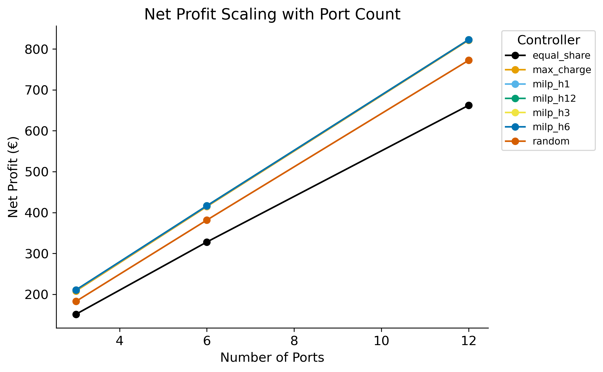
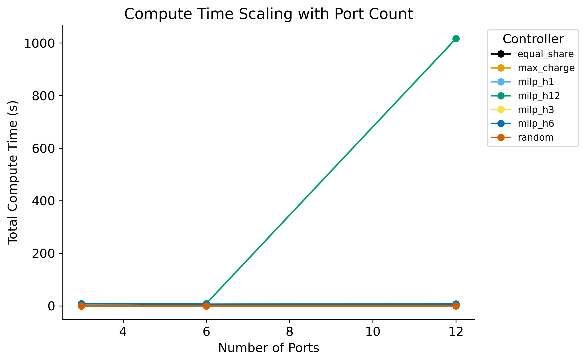
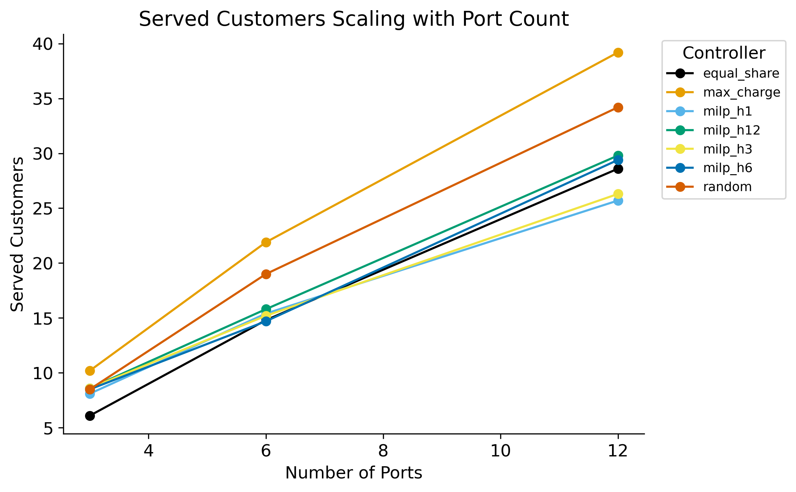

# Benchmark Report — `0_75_p3_6_12_h1_3_6_12`

## Experiment Configuration

| Setting | Value |
|---|---|
| tariff | 0.75 |
| bess_enabled | True |
| v2g_enabled | True |
| solver | highs |
| ports | [3, 6, 12] |

Experiment IDs: 0_75_p3_6_12_h1_3_6_12

## Key Findings

- **Best net_profit:** `milp_h12` with mean **€483.45**
- **Lowest compute time:** `max_charge` at 0.00 ms/step
- **Best efficiency (€/compute-s):** `max_charge` = 361675.622

## Best-Performing Controller

      best_controller  mean_net_profit
ports                                 
3             milp_h6           210.78
6            milp_h12           416.71
12           milp_h12           822.90

## Full Results Table

                   net_profit_mean  net_profit_std  net_profit_min  net_profit_max  net_profit_median  net_profit_n  net_profit_ci_lower  net_profit_ci_upper  total_revenue_mean  total_revenue_std  total_revenue_min  total_revenue_max  total_revenue_median  total_revenue_n  total_revenue_ci_lower  total_revenue_ci_upper  total_cost_mean  total_cost_std  total_cost_min  total_cost_max  total_cost_median  total_cost_n  total_cost_ci_lower  total_cost_ci_upper  served_customers_mean  served_customers_std  served_customers_min  served_customers_max  served_customers_median  served_customers_n  served_customers_ci_lower  served_customers_ci_upper  rejected_customers_mean  rejected_customers_std  rejected_customers_min  rejected_customers_max  rejected_customers_median  rejected_customers_n  rejected_customers_ci_lower  rejected_customers_ci_upper  mean_soc_fulfillment_mean  mean_soc_fulfillment_std  mean_soc_fulfillment_min  mean_soc_fulfillment_max  mean_soc_fulfillment_median  mean_soc_fulfillment_n  mean_soc_fulfillment_ci_lower  mean_soc_fulfillment_ci_upper  gap_to_best_mean  gap_to_best_std  gap_to_best_min  gap_to_best_max  gap_to_best_median  gap_to_best_n  gap_to_best_ci_lower  gap_to_best_ci_upper  total_compute_s_mean  total_compute_s_std  total_compute_s_min  total_compute_s_max  total_compute_s_median  total_compute_s_n  total_compute_s_ci_lower  total_compute_s_ci_upper  mean_step_ms_mean  mean_step_ms_std  mean_step_ms_min  mean_step_ms_max  mean_step_ms_median  mean_step_ms_n  mean_step_ms_ci_lower  mean_step_ms_ci_upper
controller  ports                                                                                                                                                                                                                                                                                                                                                                                                                                                                                                                                                                                                                                                                                                                                                                                                                                                                                                                                                                                                                                                                                                                                                                                                                                                                                                                                                                                                                                                                                                                                                                                                    
equal_share 3               151.25           40.13           97.70          229.98             146.47            10               126.38               176.13              232.92              58.49             155.53             318.80                227.39               10                  196.67                  269.18            81.67           22.82           57.83          133.27              80.92            10                67.53                95.81                    6.1                   2.9                     2                    10                      6.5                  10                        4.3                        7.9                    239.0                    16.5                     218                     273                      237.5                    10                        228.8                        249.2                      0.929                     0.124                     0.641                     0.998                        0.997                      10                          0.852                          1.006            -59.56            37.32          -105.31            -4.47              -62.12             10                -82.69                -36.42                  0.00                 0.00                 0.00                 0.00                    0.00                 10                      0.00                      0.00               0.01              0.00              0.01              0.01                 0.01              10                   0.01                   0.01
            6               327.95           40.92          255.32          374.24             333.35            10               302.59               353.31              503.34              47.79             405.94             559.63                508.16               10                  473.71                  532.96           175.39           21.18          137.76          208.03             179.80            10               162.26               188.51                   14.8                   4.7                     6                    19                     16.0                  10                       11.9                       17.7                    227.3                    20.1                     206                     270                      225.5                    10                        214.8                        239.8                      0.873                     0.166                     0.472                     0.998                        0.912                      10                          0.770                          0.976            -88.77            28.09          -143.17           -55.49              -84.14             10               -106.18                -71.35                  0.00                 0.00                 0.00                 0.00                    0.00                 10                      0.00                      0.00               0.01              0.00              0.01              0.01                 0.01              10                   0.01                   0.01
            12              662.22           68.09          567.44          799.67             653.92            10               620.02               704.42             1019.15              70.89             868.57            1101.84               1027.37               10                  975.21                 1063.08           356.92           39.87          301.13          423.40             355.97            10               332.21               381.64                   28.6                   4.3                    20                    35                     29.5                  10                       26.0                       31.2                    207.7                    17.2                     190                     240                      203.0                    10                        197.1                        218.3                      0.904                     0.070                     0.762                     0.996                        0.921                      10                          0.860                          0.947           -160.68            45.83          -265.86          -110.52             -148.69             10               -189.09               -132.27                  0.01                 0.00                 0.01                 0.01                    0.01                 10                      0.01                      0.01               0.03              0.01              0.02              0.04                 0.03              10                   0.03                   0.03
max_charge  3               208.16           11.75          187.01          232.17             207.98            10               200.87               215.44              321.10               1.14             319.17             322.87                321.02               10                  320.40                  321.80           112.94           12.09           88.45          134.41             113.34            10               105.45               120.44                   10.2                   2.1                     7                    13                     10.5                  10                        8.9                       11.5                    234.9                    16.4                     218                     266                      233.0                    10                        224.7                        245.1                      0.922                     0.090                     0.778                     0.998                        0.961                      10                          0.866                          0.978             -2.65             0.64            -3.30            -1.59               -2.94             10                 -3.05                 -2.26                  0.00                 0.00                 0.00                 0.00                    0.00                 10                      0.00                      0.00               0.00              0.00              0.00              0.00                 0.00              10                   0.00                   0.00
            6               414.61           23.58          373.53          463.47             414.24            10               400.00               429.23              639.54               3.10             633.00             643.80                640.35               10                  637.62                  641.46           224.93           24.15          176.48          268.52             226.11            10               209.96               239.90                   21.9                   4.4                    16                    28                     22.5                  10                       19.2                       24.6                    220.2                    19.4                     196                     259                      219.0                    10                        208.2                        232.2                      0.900                     0.103                     0.679                     0.998                        0.930                      10                          0.836                          0.964             -2.10             0.63            -2.98            -1.14               -2.31             10                 -2.49                 -1.71                  0.00                 0.00                 0.00                 0.00                    0.00                 10                      0.00                      0.00               0.00              0.00              0.00              0.00                 0.00              10                   0.00                   0.00
            12              821.53           47.72          740.42          920.82             825.11            10               791.95               851.10             1267.11               8.77            1247.20            1275.40               1269.05               10                 1261.67                 1272.55           445.58           47.94          349.98          532.98             449.56            10               415.87               475.29                   39.2                   2.9                    35                    43                     39.5                  10                       37.4                       41.0                    197.2                    16.0                     182                     229                      192.0                    10                        187.3                        207.1                      0.917                     0.045                     0.850                     0.996                        0.907                      10                          0.890                          0.945             -1.37             0.34            -2.02            -1.11               -1.23             10                 -1.58                 -1.16                  0.00                 0.00                 0.00                 0.00                    0.00                 10                      0.00                      0.00               0.01              0.00              0.01              0.01                 0.01              10                   0.01                   0.01
milp_h1     3               210.23           11.73          189.81          234.62             210.35            10               202.95               217.50              322.43               1.42             320.37             324.50                322.82               10                  321.55                  323.31           112.20           12.05           88.11          134.04             112.72            10               104.73               119.67                    8.1                   1.1                     6                     9                      8.5                  10                        7.4                        8.8                    237.1                    16.7                     219                     270                      233.5                    10                        226.8                        247.4                      0.909                     0.116                     0.726                     0.999                        0.997                      10                          0.837                          0.981             -0.58             0.49            -1.48            -0.07               -0.32             10                 -0.89                 -0.28                  4.41                 0.35                 4.09                 5.13                    4.28                 10                      4.19                      4.63              15.31              1.22             14.20             17.83                14.85              10                  14.55                  16.06
            6               416.19           23.63          375.63          465.69             416.27            10               401.54               430.83              640.10               3.64             632.35             644.35                641.25               10                  637.84                  642.35           223.91           24.12          175.91          267.74             225.34            10               208.96               238.86                   15.4                   3.2                    11                    22                     15.0                  10                       13.4                       17.4                    226.8                    15.3                     211                     261                      223.5                    10                        217.3                        236.3                      0.883                     0.118                     0.707                     0.999                        0.894                      10                          0.810                          0.955             -0.52             0.35            -1.14             0.00               -0.39             10                 -0.74                 -0.31                  2.62                 0.05                 2.56                 2.72                    2.61                 10                      2.59                      2.66               9.10              0.19              8.88              9.45                 9.06              10                   8.99                   9.22
            12              822.83           47.68          741.70          921.93             826.78            10               793.28               852.39             1267.25               8.93            1247.20            1276.27               1269.05               10                 1261.72                 1272.79           444.42           47.91          348.87          531.70             448.42            10               414.73               474.11                   25.7                   2.8                    22                    31                     26.0                  10                       24.0                       27.4                    210.4                    15.7                     191                     242                      208.5                    10                        200.7                        220.1                      0.861                     0.068                     0.761                     0.977                        0.843                      10                          0.819                          0.903             -0.07             0.15            -0.43             0.00                0.00             10                 -0.16                  0.02                  2.88                 0.06                 2.78                 2.99                    2.89                 10                      2.84                      2.92              10.00              0.22              9.67             10.39                10.04              10                   9.87                  10.14
milp_h12    3               210.74           11.84          189.83          235.25             210.55            10               203.40               218.08              323.24               1.63             320.40             326.17                323.41               10                  322.23                  324.26           112.51           12.02           88.37          134.02             113.11            10               105.06               119.96                    8.6                   2.1                     6                    12                      9.0                  10                        7.3                        9.9                    236.5                    16.8                     217                     271                      234.0                    10                        226.1                        246.9                      0.919                     0.089                     0.780                     1.000                        0.952                      10                          0.863                          0.974             -0.07             0.10            -0.21             0.00                0.00             10                 -0.13                 -0.01                  7.99                 2.79                 5.23                13.64                    7.21                 10                      6.27                      9.72              27.76              9.68             18.18             47.36                25.05              10                  21.76                  33.76
            6               416.71           23.52          376.50          466.03             416.55            10               402.14               431.29              640.91               3.63             633.00             645.72                641.71               10                  638.66                  643.16           224.20           24.18          176.07          268.25             225.50            10               209.21               239.19                   15.8                   3.0                    11                    21                     16.0                  10                       13.9                       17.7                    226.7                    18.3                     208                     265                      222.0                    10                        215.4                        238.0                      0.929                     0.102                     0.717                     0.999                        0.998                      10                          0.866                          0.992             -0.00             0.00            -0.00             0.00                0.00             10                 -0.00                  0.00                  8.48                 1.71                 6.94                12.31                    7.71                 10                      7.42                      9.54              29.44              5.94             24.10             42.75                26.77              10                  25.76                  33.12
            12              822.90           47.69          741.70          921.93             827.12            10               793.34               852.46             1267.36               9.05            1247.20            1276.65               1269.05               10                 1261.75                 1272.97           444.46           47.91          348.87          531.70             448.55            10               414.77               474.15                   29.8                   5.8                    19                    39                     29.5                  10                       26.2                       33.4                    207.2                    16.3                     189                     240                      205.5                    10                        197.1                        217.3                      0.890                     0.072                     0.730                     0.999                        0.906                      10                          0.845                          0.935             -0.00             0.00            -0.00             0.00               -0.00             10                 -0.00                 -0.00               1016.94              3120.79                10.98              9898.77                   38.43                 10                   -917.35                   2951.22            3531.03          10836.07             38.12          34370.73               133.44              10               -3185.23               10247.29
milp_h3     3               210.34           11.61          190.00          234.38             209.83            10               203.15               217.54              322.66               1.73             320.65             325.80                322.09               10                  321.59                  323.73           112.32           12.13           88.02          134.18             112.67            10               104.80               119.84                    8.6                   1.7                     6                    12                      9.0                  10                        7.5                        9.7                    236.7                    16.5                     220                     270                      232.0                    10                        226.5                        246.9                      0.972                     0.040                     0.883                     0.999                        0.996                      10                          0.948                          0.997             -0.47             0.43            -1.04             0.00               -0.37             10                 -0.73                 -0.20                  9.49                 2.58                 5.42                13.39                    9.76                 10                      7.89                     11.09              32.94              8.96             18.83             46.49                33.89              10                  27.38                  38.50
            6               416.36           23.64          375.63          465.69             416.27            10               401.71               431.01              640.37               3.32             633.00             644.41                641.43               10                  638.31                  642.43           224.01           24.09          175.91          267.74             225.34            10               209.08               238.94                   15.2                   2.0                    12                    18                     15.5                  10                       13.9                       16.5                    227.0                    16.2                     211                     260                      223.5                    10                        217.0                        237.0                      0.910                     0.071                     0.802                     0.998                        0.892                      10                          0.866                          0.954             -0.35             0.33            -0.87             0.00               -0.28             10                 -0.56                 -0.15                  4.10                 0.93                 3.31                 6.01                    3.80                 10                      3.53                      4.68              14.25              3.23             11.49             20.89                13.20              10                  12.25                  16.25
            12              822.88           47.69          741.70          921.93             827.02            10               793.32               852.44             1267.33               9.01            1247.20            1276.65               1269.05               10                 1261.74                 1272.91           444.45           47.91          348.87          531.70             448.49            10               414.75               474.14                   26.3                   3.5                    22                    32                     26.0                  10                       24.2                       28.4                    211.2                    16.9                     196                     245                      204.5                    10                        200.8                        221.6                      0.885                     0.084                     0.732                     0.997                        0.922                      10                          0.832                          0.937             -0.02             0.06            -0.19             0.00               -0.00             10                 -0.06                  0.02                  4.89                 0.56                 4.47                 6.38                    4.76                 10                      4.54                      5.23              16.96              1.94             15.51             22.14                16.53              10                  15.76                  18.16
milp_h6     3               210.78           11.84          190.00          235.42             210.55            10               203.44               218.11              323.31               1.65             320.72             326.05                323.51               10                  322.29                  324.33           112.53           12.06           88.40          134.18             113.11            10               105.06               120.01                    8.5                   2.1                     5                    11                      9.0                  10                        7.2                        9.8                    236.6                    16.2                     216                     268                      234.0                    10                        226.6                        246.6                      0.898                     0.135                     0.674                     0.999                        0.998                      10                          0.815                          0.982             -0.03             0.08            -0.24             0.00                0.00             10                 -0.08                  0.02                  8.58                 3.28                 6.12                17.12                    7.58                 10                      6.55                     10.61              29.79             11.38             21.25             59.45                26.31              10                  22.74                  36.85
            6               416.47           23.60          375.86          465.94             416.31            10               401.85               431.10              640.54               3.52             633.00             645.22                641.55               10                  638.36                  642.73           224.07           24.13          176.04          267.89             225.35            10               209.12               239.03                   14.7                   2.7                    12                    20                     14.0                  10                       13.0                       16.4                    227.7                    17.7                     210                     264                      223.5                    10                        216.7                        238.7                      0.931                     0.101                     0.776                     0.999                        0.997                      10                          0.869                          0.994             -0.24             0.25            -0.64             0.00               -0.21             10                 -0.39                 -0.09                  5.90                 1.48                 4.61                 8.63                    5.25                 10                      4.99                      6.82              20.50              5.13             16.01             29.97                18.24              10                  17.33                  23.68
            12              822.77           47.65          741.70          921.93             826.97            10               793.24               852.31             1267.16               9.08            1247.20            1276.65               1269.05               10                 1261.53                 1272.79           444.38           47.93          348.87          531.70             448.45            10               414.67               474.09                   29.4                   5.6                    21                    42                     29.5                  10                       25.9                       32.9                    207.4                    16.0                     187                     243                      203.0                    10                        197.5                        217.3                      0.926                     0.061                     0.826                     0.999                        0.938                      10                          0.888                          0.964             -0.13             0.31            -0.96            -0.00               -0.00             10                 -0.32                  0.06                  7.06                 0.46                 6.28                 7.78                    6.99                 10                      6.78                      7.34              24.51              1.59             21.81             27.03                24.27              10                  23.53                  25.50
random      3               182.78            8.78          168.00          200.03             183.39            10               177.33               188.22              282.17               4.02             276.67             288.91                281.68               10                  279.67                  284.66            99.39           11.50           76.65          120.90              99.30            10                92.26               106.52                    8.5                   2.2                     6                    13                      8.5                  10                        7.2                        9.8                    236.7                    17.2                     220                     273                      233.5                    10                        226.1                        247.3                      0.965                     0.056                     0.835                     1.000                        0.997                      10                          0.930                          1.000            -28.03             3.95           -35.39           -22.00              -28.43             10                -30.48                -25.58                  0.01                 0.00                 0.01                 0.01                    0.01                 10                      0.01                      0.01               0.02              0.00              0.02              0.02                 0.02              10                   0.02                   0.02
            6               381.55           22.28          346.65          429.46             379.79            10               367.74               395.36              588.48               5.47             578.73             596.47                589.65               10                  585.09                  591.87           206.93           22.54          163.15          249.82             206.20            10               192.96               220.90                   19.0                   3.4                    13                    24                     19.0                  10                       16.9                       21.1                    223.3                    16.9                     204                     259                      220.0                    10                        212.8                        233.8                      0.890                     0.082                     0.788                     0.998                        0.877                      10                          0.839                          0.940            -35.16             3.02           -38.94           -29.85              -35.11             10                -37.04                -33.29                  0.01                 0.00                 0.01                 0.01                    0.01                 10                      0.01                      0.01               0.03              0.01              0.03              0.05                 0.03              10                   0.03                   0.04
            12              772.28           46.40          685.04          858.34             777.34            10               743.52               801.04             1191.00              12.46            1169.18            1212.13               1192.21               10                 1183.27                 1198.72           418.72           45.06          324.46          495.68             421.63            10               390.79               446.65                   34.2                   4.6                    27                    43                     33.0                  10                       31.3                       37.1                    202.0                    16.7                     186                     238                      196.5                    10                        191.6                        212.4                      0.902                     0.065                     0.793                     0.998                        0.902                      10                          0.861                          0.942            -50.62             6.80           -63.59           -42.26              -49.12             10                -54.84                -46.41                  0.04                 0.00                 0.04                 0.04                    0.04                 10                      0.04                      0.04               0.14              0.01              0.13              0.14                 0.14              10                   0.13                   0.14

## Trade-off Analysis

                   net_profit  mean_step_ms  served_customers  rejected_customers
controller  ports                                                                
equal_share 3          151.25          0.01               6.1               239.0
            6          327.95          0.01              14.8               227.3
            12         662.22          0.03              28.6               207.7
max_charge  3          208.16          0.00              10.2               234.9
            6          414.61          0.00              21.9               220.2
            12         821.53          0.01              39.2               197.2
milp_h1     3          210.23         15.31               8.1               237.1
            6          416.19          9.10              15.4               226.8
            12         822.83         10.00              25.7               210.4
milp_h12    3          210.74         27.76               8.6               236.5
            6          416.71         29.44              15.8               226.7
            12         822.90       3531.03              29.8               207.2
milp_h3     3          210.34         32.94               8.6               236.7
            6          416.36         14.25              15.2               227.0
            12         822.88         16.96              26.3               211.2
milp_h6     3          210.78         29.79               8.5               236.6
            6          416.47         20.50              14.7               227.7
            12         822.77         24.51              29.4               207.4
random      3          182.78          0.02               8.5               236.7
            6          381.55          0.03              19.0               223.3
            12         772.28          0.14              34.2               202.0

## Scalability Analysis

## Statistical Significance Analysis

# Statistical Significance Summary

Metric: `net_profit`

Total pairs tested: 21  
Significant pairs (p < 0.05): 20

## Significant Differences

- **equal_share** vs **max_charge**: mean diff = -100.959, p (t-test) = 0.0000, Cohen's d = -1.775
- **equal_share** vs **milp_h1**: mean diff = -102.608, p (t-test) = 0.0000, Cohen's d = -1.812
- **equal_share** vs **milp_h12**: mean diff = -102.976, p (t-test) = 0.0000, Cohen's d = -1.820
- **equal_share** vs **milp_h3**: mean diff = -102.720, p (t-test) = 0.0000, Cohen's d = -1.812
- **equal_share** vs **milp_h6**: mean diff = -102.868, p (t-test) = 0.0000, Cohen's d = -1.820
- **equal_share** vs **random**: mean diff = -65.061, p (t-test) = 0.0000, Cohen's d = -1.314
- **max_charge** vs **milp_h1**: mean diff = -1.650, p (t-test) = 0.0000, Cohen's d = -2.469
- **max_charge** vs **milp_h12**: mean diff = -2.017, p (t-test) = 0.0000, Cohen's d = -2.739
- **max_charge** vs **milp_h3**: mean diff = -1.762, p (t-test) = 0.0000, Cohen's d = -2.827
- **max_charge** vs **milp_h6**: mean diff = -1.909, p (t-test) = 0.0000, Cohen's d = -2.447
- **max_charge** vs **random**: mean diff = 35.898, p (t-test) = 0.0000, Cohen's d = 3.217
- **milp_h1** vs **milp_h12**: mean diff = -0.367, p (t-test) = 0.0000, Cohen's d = -0.897
- **milp_h1** vs **milp_h6**: mean diff = -0.260, p (t-test) = 0.0032, Cohen's d = -0.586
- **milp_h1** vs **random**: mean diff = 37.548, p (t-test) = 0.0000, Cohen's d = 3.443
- **milp_h12** vs **milp_h3**: mean diff = 0.255, p (t-test) = 0.0006, Cohen's d = 0.701
- **milp_h12** vs **milp_h6**: mean diff = 0.108, p (t-test) = 0.0317, Cohen's d = 0.412
- **milp_h12** vs **random**: mean diff = 37.915, p (t-test) = 0.0000, Cohen's d = 3.543
- **milp_h3** vs **milp_h6**: mean diff = -0.148, p (t-test) = 0.0469, Cohen's d = -0.379
- **milp_h3** vs **random**: mean diff = 37.660, p (t-test) = 0.0000, Cohen's d = 3.472
- **milp_h6** vs **random**: mean diff = 37.807, p (t-test) = 0.0000, Cohen's d = 3.541

## Correlation Analysis

## Correlation Summary
**Top 5 positive correlations:**
- `total_compute_s` ↔ `mean_step_ms`: r = 1.000
- `net_profit` ↔ `total_revenue`: r = 0.993
- `total_revenue` ↔ `total_cost`: r = 0.978
- `net_profit` ↔ `total_cost`: r = 0.948
- `total_revenue` ↔ `served_customers`: r = 0.898

**Top 5 negative correlations:**
- `net_profit` ↔ `rejected_customers`: r = -0.652
- `served_customers` ↔ `rejected_customers`: r = -0.626
- `total_revenue` ↔ `rejected_customers`: r = -0.615
- `total_cost` ↔ `rejected_customers`: r = -0.525
- `served_customers` ↔ `mean_soc_fulfillment`: r = -0.169

## Robustness Analysis

                       cv     iqr  worst_case  best_case
controller  ports                                       
equal_share 3      0.2653  55.682       97.70     229.98
            6      0.1248  56.349      255.32     374.24
            12     0.1028  85.401      567.44     799.67
max_charge  3      0.0564  10.968      187.01     232.17
            6      0.0569  22.987      373.53     463.47
            12     0.0581  43.861      740.42     920.82
milp_h1     3      0.0558  11.572      189.81     234.62
            6      0.0568  22.821      375.63     465.69
            12     0.0579  43.836      741.70     921.93
milp_h12    3      0.0562  11.514      189.83     235.25
            6      0.0564  22.222      376.50     466.03
            12     0.0580  43.836      741.70     921.93
milp_h3     3      0.0552  11.727      190.00     234.38
            6      0.0568  22.725      375.63     465.69
            12     0.0580  43.836      741.70     921.93
milp_h6     3      0.0562  11.729      190.00     235.42
            6      0.0567  22.363      375.86     465.94
            12     0.0579  43.120      741.70     921.93
random      3      0.0480   8.592      168.00     200.03
            6      0.0584  20.584      346.65     429.46
            12     0.0601  43.342      685.04     858.34
