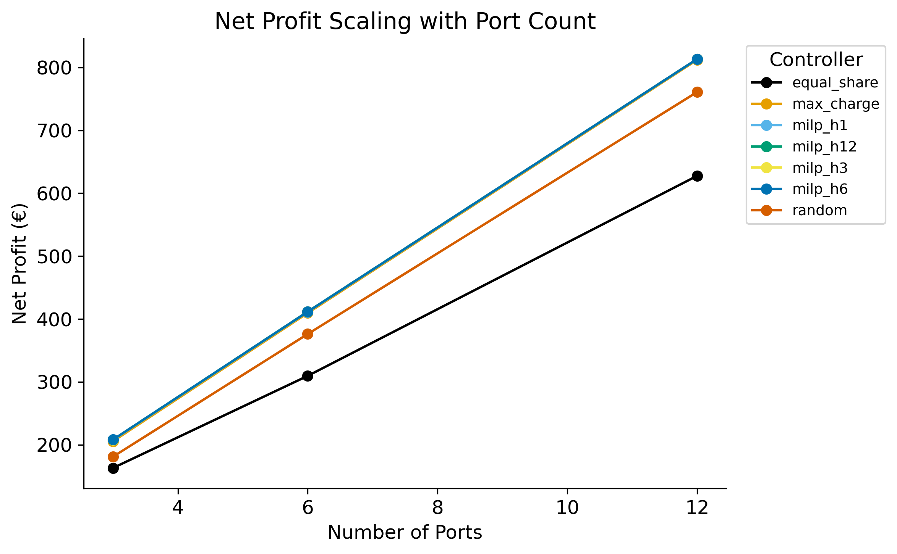
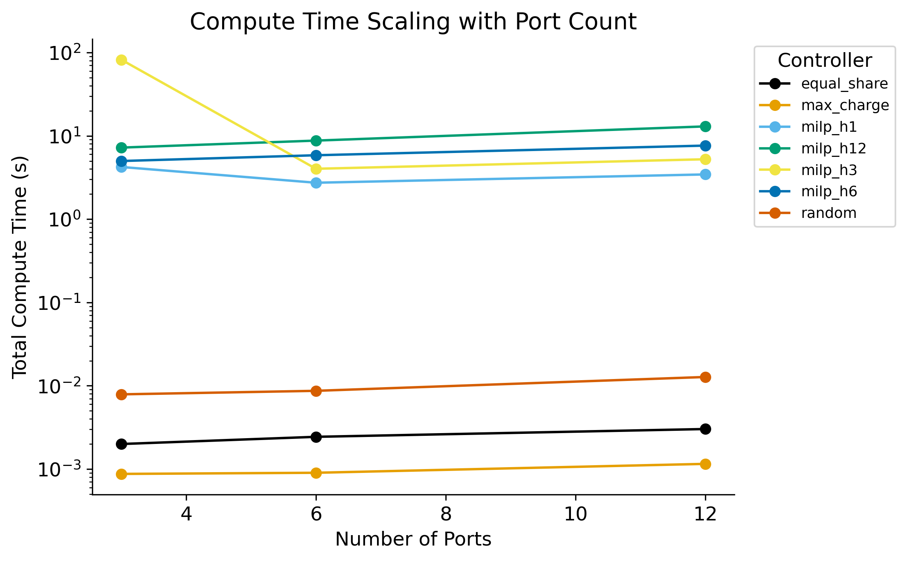
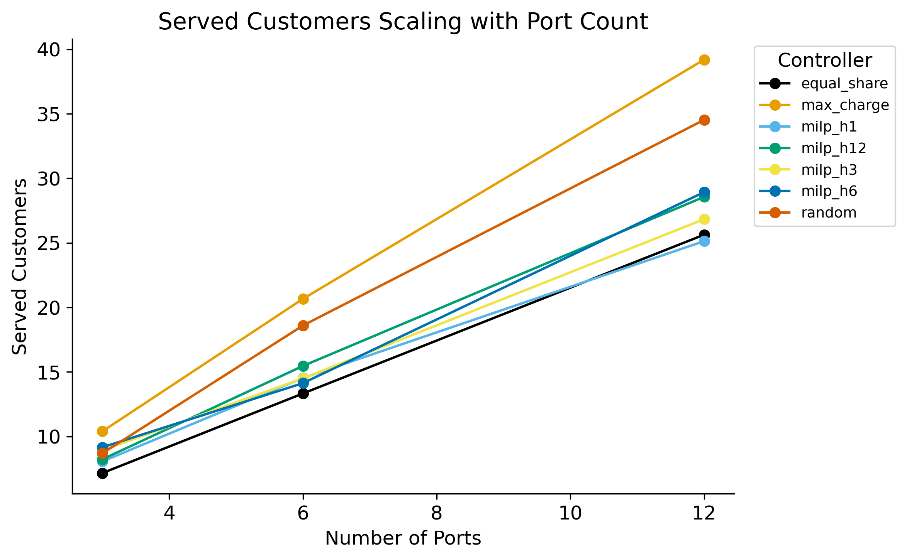

# Benchmark Report — `0_75_p3_6_12_h1_3_6_12`

## Experiment Configuration

| Setting | Value |
|---|---|
| tariff | 0.75 |
| bess_enabled | True |
| v2g_enabled | True |
| solver | highs |
| ports | [3, 6, 12] |

Experiment IDs: 0_75_p3_6_12_h1_3_6_12

## Key Findings

- **Best net_profit:** `milp_h12` with mean **€477.67**
- **Lowest compute time:** `max_charge` at 0.00 ms/step
- **Best efficiency (€/compute-s):** `max_charge` = 465795.650

## Best-Performing Controller

      best_controller  mean_net_profit
ports                                 
3             milp_h6           208.09
6            milp_h12           411.65
12            milp_h6           813.40

## Full Results Table

                   net_profit_mean  net_profit_std  net_profit_min  net_profit_max  net_profit_median  net_profit_n  net_profit_ci_lower  net_profit_ci_upper  total_revenue_mean  total_revenue_std  total_revenue_min  total_revenue_max  total_revenue_median  total_revenue_n  total_revenue_ci_lower  total_revenue_ci_upper  total_cost_mean  total_cost_std  total_cost_min  total_cost_max  total_cost_median  total_cost_n  total_cost_ci_lower  total_cost_ci_upper  served_customers_mean  served_customers_std  served_customers_min  served_customers_max  served_customers_median  served_customers_n  served_customers_ci_lower  served_customers_ci_upper  rejected_customers_mean  rejected_customers_std  rejected_customers_min  rejected_customers_max  rejected_customers_median  rejected_customers_n  rejected_customers_ci_lower  rejected_customers_ci_upper  mean_soc_fulfillment_mean  mean_soc_fulfillment_std  mean_soc_fulfillment_min  mean_soc_fulfillment_max  mean_soc_fulfillment_median  mean_soc_fulfillment_n  mean_soc_fulfillment_ci_lower  mean_soc_fulfillment_ci_upper  gap_to_best_mean  gap_to_best_std  gap_to_best_min  gap_to_best_max  gap_to_best_median  gap_to_best_n  gap_to_best_ci_lower  gap_to_best_ci_upper  total_compute_s_mean  total_compute_s_std  total_compute_s_min  total_compute_s_max  total_compute_s_median  total_compute_s_n  total_compute_s_ci_lower  total_compute_s_ci_upper  mean_step_ms_mean  mean_step_ms_std  mean_step_ms_min  mean_step_ms_max  mean_step_ms_median  mean_step_ms_n  mean_step_ms_ci_lower  mean_step_ms_ci_upper
controller  ports                                                                                                                                                                                                                                                                                                                                                                                                                                                                                                                                                                                                                                                                                                                                                                                                                                                                                                                                                                                                                                                                                                                                                                                                                                                                                                                                                                                                                                                                                                                                                                                                    
equal_share 3               163.09           38.94           76.33          240.02             163.69            30               149.15               177.02              254.67              56.60             120.15             319.72                263.38               30                  234.42                  274.93            91.58           27.32           43.82          159.79              88.54            30                81.81               101.36                    7.2                   3.0                     1                    12                      7.5                  30                        6.1                        8.3                    235.3                    14.7                     206                     273                      236.5                    30                        230.0                        240.6                      0.911                     0.195                     0.000                     0.999                        0.996                      30                          0.842                          0.981            -45.10            36.39          -131.17            -4.40              -39.38             30                -58.12                -32.08                  0.00                 0.00                 0.00                 0.00                    0.00                 30                      0.00                      0.00               0.01              0.00              0.01              0.01                 0.01              30                   0.01                   0.01
            6               309.54           53.95          202.03          419.36             317.03            30               290.23               328.84              481.34              68.67             320.15             581.44                492.97               30                  456.77                  505.91           171.80           34.29          108.29          219.15             181.01            30               159.53               184.07                   13.3                   4.4                     6                    20                     13.0                  30                       11.8                       14.9                    226.1                    16.5                     188                     270                      226.5                    30                        220.2                        232.0                      0.879                     0.125                     0.472                     0.998                        0.895                      30                          0.835                          0.924           -102.15            45.61          -203.79           -38.74              -94.33             30               -118.47                -85.83                  0.00                 0.00                 0.00                 0.00                    0.00                 30                      0.00                      0.00               0.01              0.00              0.01              0.01                 0.01              30                   0.01                   0.01
            12              627.65           93.38          473.71          816.17             626.04            30               594.23               661.06              977.19             108.36             682.18            1238.03                978.97               30                  938.41                 1015.97           349.54           63.38          162.98          464.74             352.15            30               326.86               372.22                   25.6                   5.9                    12                    38                     26.0                  30                       23.5                       27.7                    208.0                    16.7                     176                     240                      207.0                    30                        202.0                        214.0                      0.897                     0.088                     0.629                     0.997                        0.912                      30                          0.866                          0.929           -185.82            73.86          -440.69           -29.75             -167.21             30               -212.25               -159.39                  0.00                 0.00                 0.00                 0.00                    0.00                 30                      0.00                      0.00               0.01              0.00              0.01              0.01                 0.01              30                   0.01                   0.01
max_charge  3               205.56           18.77          161.33          245.85             205.27            30               198.84               212.28              321.09               1.40             318.02             322.87                321.42               30                  320.59                  321.59           115.53           18.76           76.70          161.22             116.43            30               108.81               122.24                   10.4                   1.8                     7                    13                     10.0                  30                        9.7                       11.1                    232.1                    15.2                     196                     266                      234.5                    30                        226.7                        237.6                      0.947                     0.069                     0.778                     0.999                        0.996                      30                          0.922                          0.972             -2.63             0.65            -3.35            -1.09               -2.87             30                 -2.86                 -2.40                  0.00                 0.00                 0.00                 0.00                    0.00                 30                      0.00                      0.00               0.00              0.00              0.00              0.00                 0.00              30                   0.00                   0.00
            6               409.48           37.70          321.86          491.08             408.51            30               395.99               422.98              639.61               3.73             629.65             645.10                640.42               30                  638.28                  640.95           230.13           37.34          153.22          321.79             231.06            30               216.77               243.49                   20.7                   3.5                    14                    28                     20.0                  30                       19.4                       21.9                    218.8                    16.3                     186                     259                      220.0                    30                        213.0                        224.7                      0.898                     0.092                     0.615                     0.999                        0.902                      30                          0.865                          0.931             -2.20             0.64            -3.28            -1.14               -2.29             30                 -2.43                 -1.97                  0.00                 0.00                 0.00                 0.00                    0.00                 30                      0.00                      0.00               0.00              0.00              0.00              0.00                 0.00              30                   0.00                   0.00
            12              812.09           76.14          633.70          978.79             807.98            30               784.84               839.34             1268.46               8.67            1247.20            1284.20               1268.80               30                 1265.35                 1271.56           456.37           73.73          305.41          635.30             458.22            30               429.98               482.75                   39.2                   2.9                    32                    43                     40.0                  30                       38.2                       40.2                    194.6                    15.9                     158                     229                      197.0                    30                        188.9                        200.3                      0.924                     0.045                     0.849                     0.998                        0.914                      30                          0.907                          0.940             -1.37             0.35            -2.25            -0.78               -1.24             30                 -1.50                 -1.25                  0.00                 0.00                 0.00                 0.00                    0.00                 30                      0.00                      0.00               0.00              0.00              0.00              0.00                 0.00              30                   0.00                   0.00
milp_h1     3               207.67           18.68          164.14          247.50             206.65            30               200.99               214.35              322.49               1.96             318.02             325.77                322.92               30                  321.79                  323.19           114.82           18.70           76.18          160.69             115.15            30               108.13               121.51                    8.1                   1.9                     5                    14                      8.0                  30                        7.4                        8.8                    234.4                    15.0                     200                     270                      235.0                    30                        229.1                        239.8                      0.906                     0.194                     0.000                     0.999                        0.997                      30                          0.837                          0.975             -0.52             0.43            -1.48             0.00               -0.33             30                 -0.68                 -0.37                  4.23                 0.71                 3.80                 6.15                    3.96                 30                      3.98                      4.48              14.69              2.45             13.19             21.34                13.74              30                  13.81                  15.56
            6               411.14           37.93          323.71          493.98             409.81            30               397.56               424.71              640.27               4.32             629.00             647.05                641.05               30                  638.72                  641.81           229.13           37.06          153.07          320.54             229.89            30               215.87               242.39                   14.5                   3.2                     7                    22                     14.5                  30                       13.4                       15.7                    225.1                    16.1                     190                     261                      225.5                    30                        219.3                        230.8                      0.872                     0.146                     0.304                     0.999                        0.893                      30                          0.820                          0.925             -0.55             0.42            -1.94             0.00               -0.39             30                 -0.70                 -0.40                  2.74                 0.10                 2.61                 2.98                    2.73                 30                      2.70                      2.77               9.50              0.34              9.06             10.34                 9.47              30                   9.38                   9.62
            12              813.18           75.83          635.23          979.77             809.13            30               786.05               840.31             1268.27               8.54            1247.20            1284.45               1268.80               30                 1265.21                 1271.33           455.09           73.71          304.68          633.77             457.04            30               428.71               481.47                   25.1                   3.7                    18                    32                     24.5                  30                       23.8                       26.5                    208.5                    15.7                     174                     242                      209.5                    30                        202.9                        214.1                      0.896                     0.070                     0.756                     0.998                        0.897                      30                          0.871                          0.921             -0.29             0.83            -4.43             0.00                0.00             30                 -0.58                  0.01                  3.44                 0.70                 2.99                 5.67                    3.25                 30                      3.19                      3.69              11.95              2.44             10.37             19.67                11.28              30                  11.08                  12.83
milp_h12    3               208.00           18.77          164.33          248.74             207.59            30               201.28               214.71              323.01               2.03             318.02             326.17                323.49               30                  322.28                  323.74           115.01           18.72           76.56          160.94             115.42            30               108.32               121.71                    8.2                   1.8                     6                    13                      8.0                  30                        7.6                        8.9                    234.3                    15.1                     200                     271                      236.0                    30                        228.9                        239.7                      0.953                     0.074                     0.780                     1.000                        0.998                      30                          0.927                          0.980             -0.20             0.49            -2.33             0.00                0.00             30                 -0.37                 -0.02                  7.23                 0.99                 5.80                10.08                    7.11                 30                      6.87                      7.58              25.09              3.43             20.15             34.99                24.70              30                  23.87                  26.32
            6               411.65           37.86          324.10          494.26             410.35            30               398.10               425.20              641.08               4.40             629.65             647.80                641.71               30                  639.51                  642.66           229.43           37.18          153.16          320.80             229.80            30               216.13               242.73                   15.5                   2.9                    11                    21                     15.0                  30                       14.4                       16.5                    224.4                    16.0                     191                     265                      226.0                    30                        218.6                        230.1                      0.913                     0.103                     0.655                     0.999                        0.934                      30                          0.876                          0.950             -0.04             0.16            -0.88             0.00                0.00             30                 -0.10                  0.02                  8.77                 1.38                 7.14                13.50                    8.53                 30                      8.28                      9.27              30.45              4.80             24.78             46.87                29.63              30                  28.73                  32.17
            12              813.36           76.10          635.23          980.03             809.13            30               786.13               840.60             1268.55               8.99            1247.20            1284.80               1268.80               30                 1265.34                 1271.77           455.19           73.56          304.77          633.77             457.04            30               428.86               481.51                   28.6                   4.2                    19                    39                     29.0                  30                       27.1                       30.1                    205.9                    14.5                     175                     240                      207.0                    30                        200.7                        211.1                      0.927                     0.058                     0.730                     0.999                        0.933                      30                          0.906                          0.948             -0.10             0.50            -2.75             0.00               -0.00             30                 -0.28                  0.08                 12.99                 1.05                11.44                15.84                   12.65                 30                     12.61                     13.36              45.09              3.63             39.71             55.02                43.91              30                  43.79                  46.39
milp_h3     3               207.85           18.77          164.28          248.49             207.21            30               201.13               214.57              322.79               2.08             318.02             326.10                323.30               30                  322.04                  323.53           114.94           18.70           76.48          160.87             115.36            30               108.25               121.63                    8.9                   2.1                     5                    15                      9.0                  30                        8.2                        9.7                    233.7                    14.9                     202                     270                      235.0                    30                        228.4                        239.0                      0.893                     0.198                     0.000                     0.999                        0.982                      30                          0.822                          0.964             -0.34             0.38            -1.24             0.00               -0.20             30                 -0.48                 -0.21                 81.98               406.09                 3.52              2231.98                    7.09                 30                    -63.33                    227.30             284.66           1410.02             12.22           7749.92                24.60              30                -219.91                 789.23
            6               411.25           37.82          323.86          493.98             409.07            30               397.72               424.78              640.45               4.17             629.65             647.05                641.23               30                  638.96                  641.94           229.20           37.17          153.07          320.60             229.85            30               215.90               242.50                   14.5                   2.2                    10                    20                     15.0                  30                       13.7                       15.3                    225.3                    14.9                     192                     260                      226.0                    30                        220.0                        230.6                      0.919                     0.076                     0.711                     0.999                        0.928                      30                          0.892                          0.946             -0.44             0.49            -2.43             0.00               -0.33             30                 -0.61                 -0.26                  4.02                 0.68                 3.40                 6.53                    3.84                 30                      3.78                      4.27              13.97              2.35             11.80             22.67                13.33              30                  13.13                  14.81
            12              813.37           76.02          635.23          979.77             809.13            30               786.16               840.57             1268.57               8.81            1247.20            1284.45               1268.80               30                 1265.42                 1271.72           455.20           73.60          304.68          633.77             457.04            30               428.86               481.54                   26.8                   3.7                    18                    36                     26.0                  30                       25.5                       28.1                    207.9                    16.2                     173                     245                      208.5                    30                        202.1                        213.7                      0.927                     0.068                     0.732                     0.998                        0.936                      30                          0.903                          0.952             -0.10             0.28            -1.42             0.00               -0.00             30                 -0.20                  0.00                  5.24                 0.48                 4.56                 6.66                    5.15                 30                      5.07                      5.41              18.19              1.66             15.85             23.12                17.89              30                  17.59                  18.78
milp_h6     3               208.09           18.87          164.33          248.49             207.27            30               201.33               214.84              323.15               2.06             318.02             326.10                323.60               30                  322.41                  323.88           115.06           18.67           76.48          160.94             115.20            30               108.38               121.74                    9.2                   2.1                     5                    15                      9.0                  30                        8.4                        9.9                    233.3                    15.2                     198                     268                      234.5                    30                        227.8                        238.7                      0.898                     0.133                     0.512                     0.999                        0.976                      30                          0.851                          0.946             -0.11             0.17            -0.55             0.00                0.00             30                 -0.17                 -0.05                  4.99                 0.52                 3.91                 5.94                    4.91                 30                      4.80                      5.18              17.32              1.82             13.58             20.63                17.05              30                  16.67                  17.97
            6               411.45           37.82          324.31          494.26             409.16            30               397.92               424.98              640.76               4.30             629.65             647.42                641.51               30                  639.22                  642.30           229.31           37.19          153.16          320.97             229.84            30               216.01               242.62                   14.1                   2.7                    10                    20                     14.0                  30                       13.2                       15.1                    225.8                    15.2                     194                     264                      226.0                    30                        220.3                        231.2                      0.926                     0.085                     0.757                     0.999                        0.984                      30                          0.895                          0.956             -0.24             0.46            -2.37             0.00               -0.00             30                 -0.40                 -0.07                  5.85                 0.93                 4.99                 8.62                    5.62                 30                      5.52                      6.18              20.31              3.22             17.33             29.93                19.53              30                  19.16                  21.46
            12              813.40           75.98          635.23          979.27             809.13            30               786.21               840.59             1268.62               8.89            1247.20            1283.80               1268.80               30                 1265.44                 1271.80           455.23           73.62          304.53          633.77             457.04            30               428.88               481.57                   28.9                   4.7                    21                    42                     29.0                  30                       27.2                       30.6                    205.7                    15.7                     172                     243                      204.0                    30                        200.1                        211.3                      0.922                     0.068                     0.787                     0.999                        0.936                      30                          0.898                          0.947             -0.07             0.22            -0.96             0.00               -0.00             30                 -0.15                  0.01                  7.64                 0.72                 6.39                 9.51                    7.57                 30                      7.38                      7.89              26.52              2.49             22.19             33.01                26.29              30                  25.63                  27.41
random      3               180.99           16.03          140.16          213.93             181.83            30               175.26               186.73              282.88               4.15             276.67             292.23                282.12               30                  281.40                  284.37           101.89           16.98           66.79          140.88             102.40            30                95.81               107.97                    8.7                   1.5                     6                    13                      9.0                  30                        8.2                        9.2                    233.8                    15.4                     199                     273                      236.0                    30                        228.3                        239.3                      0.954                     0.081                     0.682                     1.000                        0.997                      30                          0.924                          0.983            -27.20             3.97           -35.39           -21.21              -27.55             30                -28.62                -25.78                  0.01                 0.00                 0.01                 0.01                    0.01                 30                      0.01                      0.01               0.03              0.00              0.03              0.04                 0.03              30                   0.03                   0.03
            6               376.06           35.47          296.29          448.26             374.63            30               363.37               388.76              587.28               6.08             571.63             601.40                587.56               30                  585.11                  589.46           211.22           34.22          139.83          296.98             212.19            30               198.98               223.46                   18.6                   3.0                    11                    24                     18.5                  30                       17.5                       19.7                    221.0                    15.7                     187                     259                      222.5                    30                        215.4                        226.6                      0.903                     0.082                     0.737                     0.999                        0.904                      30                          0.874                          0.933            -35.62             4.28           -46.00           -28.02              -34.89             30                -37.15                -34.09                  0.01                 0.00                 0.01                 0.01                    0.01                 30                      0.01                      0.01               0.03              0.00              0.03              0.03                 0.03              30                   0.03                   0.03
            12              760.92           72.13          596.89          929.35             755.81            30               735.11               786.73             1188.71              14.63            1156.90            1219.41               1190.08               30                 1183.47                 1193.94           427.79           70.04          289.39          599.82             430.54            30               402.72               452.85                   34.5                   3.6                    27                    43                     34.0                  30                       33.2                       35.8                    199.0                    16.7                     161                     238                      202.0                    30                        193.0                        205.0                      0.915                     0.059                     0.793                     0.998                        0.913                      30                          0.894                          0.936            -52.54             7.75           -67.83           -37.74              -52.47             30                -55.32                -49.77                  0.01                 0.00                 0.01                 0.02                    0.01                 30                      0.01                      0.01               0.04              0.00              0.04              0.05                 0.04              30                   0.04                   0.05

## Trade-off Analysis

                   net_profit  mean_step_ms  served_customers  rejected_customers
controller  ports                                                                
equal_share 3          163.09          0.01              7.17              235.30
            6          309.54          0.01             13.33              226.10
            12         627.65          0.01             25.63              208.00
max_charge  3          205.56          0.00             10.40              232.13
            6          409.48          0.00             20.67              218.83
            12         812.09          0.00             39.20              194.60
milp_h1     3          207.67         14.69              8.07              234.43
            6          411.14          9.50             14.53              225.07
            12         813.18         11.95             25.13              208.47
milp_h12    3          208.00         25.09              8.23              234.27
            6          411.65         30.45             15.47              224.37
            12         813.36         45.09             28.57              205.87
milp_h3     3          207.85        284.66              8.93              233.67
            6          411.25         13.97             14.50              225.30
            12         813.37         18.19             26.83              207.93
milp_h6     3          208.09         17.32              9.17              233.27
            6          411.45         20.31             14.13              225.77
            12         813.40         26.52             28.93              205.67
random      3          180.99          0.03              8.70              233.83
            6          376.06          0.03             18.60              221.00
            12         760.92          0.04             34.53              199.00

## Scalability Analysis

## Statistical Significance Analysis

# Statistical Significance Summary

Metric: `net_profit`

Total pairs tested: 21  
Significant pairs (p < 0.05): 20

## Significant Differences

- **equal_share** vs **max_charge**: mean diff = -108.956, p (t-test) = 0.0000, Cohen's d = -1.370
- **equal_share** vs **milp_h1**: mean diff = -110.572, p (t-test) = 0.0000, Cohen's d = -1.395
- **equal_share** vs **milp_h12**: mean diff = -110.913, p (t-test) = 0.0000, Cohen's d = -1.401
- **equal_share** vs **milp_h3**: mean diff = -110.733, p (t-test) = 0.0000, Cohen's d = -1.397
- **equal_share** vs **milp_h6**: mean diff = -110.888, p (t-test) = 0.0000, Cohen's d = -1.401
- **equal_share** vs **random**: mean diff = -72.568, p (t-test) = 0.0000, Cohen's d = -1.023
- **max_charge** vs **milp_h1**: mean diff = -1.616, p (t-test) = 0.0000, Cohen's d = -1.908
- **max_charge** vs **milp_h12**: mean diff = -1.957, p (t-test) = 0.0000, Cohen's d = -2.363
- **max_charge** vs **milp_h3**: mean diff = -1.777, p (t-test) = 0.0000, Cohen's d = -2.592
- **max_charge** vs **milp_h6**: mean diff = -1.932, p (t-test) = 0.0000, Cohen's d = -2.427
- **max_charge** vs **random**: mean diff = 36.388, p (t-test) = 0.0000, Cohen's d = 2.927
- **milp_h1** vs **milp_h12**: mean diff = -0.342, p (t-test) = 0.0000, Cohen's d = -0.454
- **milp_h1** vs **milp_h3**: mean diff = -0.161, p (t-test) = 0.0159, Cohen's d = -0.259
- **milp_h1** vs **milp_h6**: mean diff = -0.316, p (t-test) = 0.0000, Cohen's d = -0.498
- **milp_h1** vs **random**: mean diff = 38.004, p (t-test) = 0.0000, Cohen's d = 3.150
- **milp_h12** vs **milp_h3**: mean diff = 0.180, p (t-test) = 0.0051, Cohen's d = 0.303
- **milp_h12** vs **random**: mean diff = 38.345, p (t-test) = 0.0000, Cohen's d = 3.199
- **milp_h3** vs **milp_h6**: mean diff = -0.155, p (t-test) = 0.0001, Cohen's d = -0.438
- **milp_h3** vs **random**: mean diff = 38.165, p (t-test) = 0.0000, Cohen's d = 3.166
- **milp_h6** vs **random**: mean diff = 38.319, p (t-test) = 0.0000, Cohen's d = 3.195

## Correlation Analysis

## Correlation Summary
**Top 5 positive correlations:**
- `total_compute_s` ↔ `mean_step_ms`: r = 1.000
- `net_profit` ↔ `total_revenue`: r = 0.983
- `total_revenue` ↔ `total_cost`: r = 0.948
- `total_revenue` ↔ `served_customers`: r = 0.898
- `net_profit` ↔ `served_customers`: r = 0.884

**Top 5 negative correlations:**
- `served_customers` ↔ `rejected_customers`: r = -0.637
- `total_revenue` ↔ `rejected_customers`: r = -0.616
- `net_profit` ↔ `rejected_customers`: r = -0.608
- `total_cost` ↔ `rejected_customers`: r = -0.579
- `rejected_customers` ↔ `profit_per_compute_s`: r = -0.244

## Robustness Analysis

                       cv      iqr  worst_case  best_case
controller  ports                                        
equal_share 3      0.2388   42.064       76.33     240.02
            6      0.1743   81.661      202.03     419.36
            12     0.1488  135.380      473.71     816.17
max_charge  3      0.0913   12.063      161.33     245.85
            6      0.0921   25.786      321.86     491.08
            12     0.0938   56.879      633.70     978.79
milp_h1     3      0.0899   13.084      164.14     247.50
            6      0.0923   27.368      323.71     493.98
            12     0.0932   57.154      635.23     979.77
milp_h12    3      0.0902   13.264      164.33     248.74
            6      0.0920   27.177      324.10     494.26
            12     0.0936   57.467      635.23     980.03
milp_h3     3      0.0903   13.030      164.28     248.49
            6      0.0920   27.105      323.86     493.98
            12     0.0935   56.399      635.23     979.77
milp_h6     3      0.0907   13.195      164.33     248.49
            6      0.0919   27.177      324.31     494.26
            12     0.0934   57.228      635.23     979.27
random      3      0.0886   12.975      140.16     213.93
            6      0.0943   27.085      296.29     448.26
            12     0.0948   61.673      596.89     929.35
